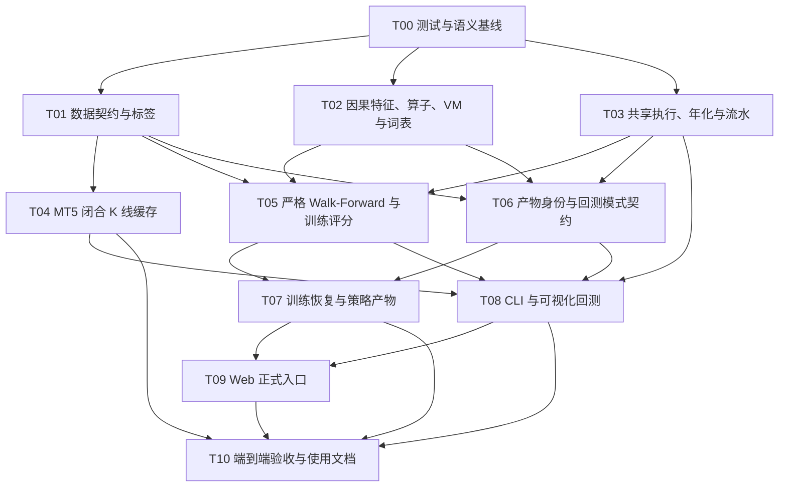

# AlphaMaster Core Correctness V2 Implementation Plan

> **For agentic workers:** REQUIRED SUB-SKILL: Use superpowers:subagent-driven-development (recommended) or superpowers:executing-plans to implement this plan task-by-task. Steps use checkbox (`- [ ]`) syntax for tracking.

**Goal:** 把 AlphaMaster 的训练、walk-forward 验证、策略产物、命令行/可视化回测和实时信号统一到严格因果、可追溯、可复现的 V2 核心语义，并明确区分样本内复盘与独立样本外回测。

**Architecture:** 先建立不可变的语义与测试基线，再并行实现数据契约、因果词表和共享执行三条上游能力；其后合并 MT5 闭合 K 线、严格 walk-forward 与产物身份；最后让训练、回测、Web 入口只消费这些共享契约。任何数据、版本、时间范围或恢复状态不匹配都 fail closed，旧 V1 产物保留在磁盘但不得加载或重标。

**Tech Stack:** Python 3.11、PyTorch、pandas、NumPy、PyArrow/Parquet、MetaTrader5 适配层、FastAPI、pytest、Hypothesis、Git worktree。

---

## 0. 调度中心使用说明

### 0.1 权威输入与工作目录

- 设计规格：`docs/superpowers/specs/2026-07-14-core-correctness-v2-design.md`
- 本实施计划：`docs/superpowers/plans/2026-07-14-core-correctness-v2.md`
- 集成 worktree：`G:\CodexProject\AlphaMaster\.worktrees\core-correctness-v2`
- 集成分支：`codex/core-correctness-v2`
- 私有远端：`core-v2`，仓库 `Mskila/core-correctness-v2`
- 项目 Python：`G:\CodexProject\AlphaMaster\.venv\Scripts\python.exe`；系统默认 `python` 指向缺少 torch/Hypothesis 的 Python 3.9，不得用于验收。
- 本轮只修复会影响训练、验证、回测、策略产物或信号一致性的模块；安全、认证、CORS、凭据、上传、XSS 和界面美化不进入任何工作包。

每个 worker 在自己的 PowerShell 命令块开头设置：

```powershell
$PY = 'G:\CodexProject\AlphaMaster\.venv\Scripts\python.exe'
& $PY --version
```

下文所有 `python` 测试/入口命令都必须实际以 `& $PY` 执行；如果工具每次启动新 PowerShell，则在该次命令中同时声明 `$PY`。

### 0.2 调度中心职责

调度中心只做五件事：建立波次基线、派发工作包、审查证据、按顺序集成、运行全量验收。调度中心不得在多个 worker 运行期间直接修改它们的独占文件。

每个 worker 开工前必须：

- [ ] 阅读设计规格、本计划和自己工作包的全部内容。
- [ ] 使用 `superpowers:test-driven-development`，先提交稳定失败的测试，再写实现。
- [ ] 遇到非预期失败时使用 `superpowers:systematic-debugging`，不得用放宽断言掩盖错误。
- [ ] 只修改工作包列出的独占文件；需要跨边界时先把请求和原因发给调度中心。
- [ ] 在交付前使用 `superpowers:verification-before-completion`，附上实际命令、退出码和测试摘要。
- [ ] 不删除旧 checkpoint、旧策略、历史报告或用户文件。

### 0.3 分支与 worktree 规则

每个波次都从该波次开始时的 `codex/core-correctness-v2` 最新提交创建工作分支。示例命令：

```powershell
git -C G:\CodexProject\AlphaMaster fetch core-v2
git -C G:\CodexProject\AlphaMaster worktree add `
  G:\CodexProject\AlphaMaster\.worktrees\v2-01-data `
  -b codex/v2-01-data codex/core-correctness-v2
```

worker 不得在集成 worktree 内开发。一个工作包可以有多个小提交，但提交信息必须能对应本计划中的步骤。调度中心审查后在集成 worktree 使用非快进合并：

```powershell
git merge --no-ff codex/v2-01-data
```

每次合并后立即运行该工作包的定向测试；一整个波次合并完成后运行波次门禁并推送：

```powershell
git push core-v2 codex/core-correctness-v2
```

### 0.4 依赖图与波次



| 波次 | 可同时运行的工作包 | 波次门禁 |
|---|---|---|
| 0 | T00 | 正式 pytest 仅收集 `tests/`；语义常量与异常可导入 |
| 1 | T01、T02、T03 | 数据、词表、执行三个定向套件全部通过，文件无交叉修改 |
| 2 | T04、T05、T06 | 闭合 K 线、严格 gap、产物兼容性全部通过 |
| 3 | T07、T08 | 确定性恢复和两种回测模式全部通过 |
| 4 | T09 | API/UI 不再静默选择训练数据或重标旧策略 |
| 5 | T10 | 全量测试、编译、端到端流程和静态语义扫描全部通过 |

### 0.5 全局不变量

所有工作包共同维护以下断言：

1. 因子在收盘 `t` 形成，仓位在开盘 `t+1` 执行，在开盘 `t+2` 退出；`target_ret[t] = log(open[t+2] / open[t+1])`。
2. 最后两个标签通过 `target_valid=False` 排除，不以零收益参加均值、方差、IC、奖励或回测。
3. 修改任意截断点之后的行情，不得改变截断点及之前的特征、算子或 VM 输出。
4. V2 为单标的系统，词表不得含 `REL_RET5`、`REL_RET20`、`REL_VOL`、`CS_RANK_RET5`、`CS_ZSCORE_RET20`、`CS_RANK`、`CS_SCALE`、`CS_NEUTRALIZE`。
5. gap 至少为标签前视长度 2，数据不足时抛 `InsufficientWalkForwardDataError`，不得缩小 gap、重叠区间或返回伪折。
6. 训练、回测、可视化和实时信号对同一因子调用同一个因子到仓位函数。
7. 执行流水净收益之和与回测净收益之和在 `1e-8` 容差内一致，并包含最终平仓成本。
8. 年化只从有效执行时间戳跨度推导，不出现 H1 专用常数 `6240`。
9. 样本外回测要求显式独立数据，且测试起点严格晚于训练终点；训练数据的副本或子集不能标成样本外。
10. checkpoint、策略和报告都携带核心、词表、标签、执行、标的、周期、数据和配置身份。
11. 固定随机种子下，“连续训练 N 步”和“训练 K 步、保存、恢复后训练 N-K 步”产生一致状态。
12. 旧产物只能被识别为不兼容并保留，不得被静默加载、删除、覆盖或改写成 V2。

---

## Task T00：正式测试收集与核心语义基线

**分支/worktree：** `codex/v2-00-foundation` / `.worktrees\v2-00-foundation`

**独占文件：**

- Create: `pytest.ini`
- Create: `model_core/semantics.py`
- Create: `tests/unit/test_semantics.py`

### Step 1：先固定 V2 常量和异常的失败测试

- [ ] 新建 `tests/unit/test_semantics.py`，写入以下完整断言：

```python
import pytest

from model_core.semantics import (
    CORE_SEMANTICS_VERSION,
    DATA_SCHEMA_VERSION,
    EXECUTION_SEMANTICS_VERSION,
    LABEL_LOOKAHEAD_BARS,
    LABEL_SEMANTICS_VERSION,
    ArtifactCompatibilityError,
    BacktestModeError,
    DataValidationError,
    DatasetAlignmentError,
    InsufficientWalkForwardDataError,
)


def test_v2_semantics_constants_are_explicit() -> None:
    assert CORE_SEMANTICS_VERSION == "2"
    assert DATA_SCHEMA_VERSION == "ohlcv-v2"
    assert LABEL_SEMANTICS_VERSION == "close-t__open-t1-to-open-t2-v2"
    assert EXECUTION_SEMANTICS_VERSION == "tanh-threshold-cost-liquidate-v2"
    assert LABEL_LOOKAHEAD_BARS == 2


@pytest.mark.parametrize(
    "error_type",
    [
        DataValidationError,
        DatasetAlignmentError,
        ArtifactCompatibilityError,
        InsufficientWalkForwardDataError,
        BacktestModeError,
    ],
)
def test_core_errors_are_runtime_errors(error_type: type[Exception]) -> None:
    assert issubclass(error_type, RuntimeError)
```

- [ ] 运行：

```powershell
& $PY -m pytest tests/unit/test_semantics.py -q
```

预期：收集阶段因 `model_core.semantics` 不存在而失败。

### Step 2：实现唯一语义常量和错误类型

- [ ] 新建 `model_core/semantics.py`；只放跨模块稳定常量与领域错误，不导入数据层、模型层或 Web 层：

```python
from __future__ import annotations

CORE_SEMANTICS_VERSION = "2"
DATA_SCHEMA_VERSION = "ohlcv-v2"
LABEL_SEMANTICS_VERSION = "close-t__open-t1-to-open-t2-v2"
EXECUTION_SEMANTICS_VERSION = "tanh-threshold-cost-liquidate-v2"
LABEL_LOOKAHEAD_BARS = 2


class CoreCorrectnessError(RuntimeError):
    """V2 核心正确性错误基类。"""


class DataValidationError(CoreCorrectnessError):
    pass


class DatasetAlignmentError(CoreCorrectnessError):
    pass


class ArtifactCompatibilityError(CoreCorrectnessError):
    pass


class InsufficientWalkForwardDataError(CoreCorrectnessError):
    pass


class BacktestModeError(CoreCorrectnessError):
    pass
```

- [ ] 重跑 `& $PY -m pytest tests/unit/test_semantics.py -q`。

预期：`6 passed`。

### Step 3：限制正式测试收集范围

- [ ] 新建根级 `pytest.ini`：

```ini
[pytest]
testpaths = tests
python_files = test_*.py
addopts = --strict-markers
markers =
    integration: cross-module deterministic integration tests
```

- [ ] 运行：

```powershell
& $PY -m pytest --collect-only -q
```

预期：退出码为 0，只显示 `tests/` 下用例，不收集 `scripts/test_import_during_training.py`，也不发起本地 HTTP 请求。

### Step 4：提交和交付证据

- [ ] 运行 `git diff --check`。
- [ ] 提交：

```powershell
git add pytest.ini model_core/semantics.py tests/unit/test_semantics.py
git commit -m "test: establish core correctness v2 baseline"
```

- [ ] 向调度中心交付：提交哈希、`6 passed`、collect-only 退出码 0、独占文件列表。

**T00 验收：** 调度中心合并后运行 `& $PY -m pytest tests/unit/test_semantics.py -q` 和 `& $PY -m pytest --collect-only -q`，全部通过后才创建波次 1 分支。

---

## Task T01：OHLCV 规范化、数据身份、标签掩码与单标的数据管理

**依赖：** T00

**分支/worktree：** `codex/v2-01-data` / `.worktrees\v2-01-data`

**独占文件：**

- Create: `data_pipeline/validation.py`
- Modify: `data_pipeline/parquet_manager.py`
- Modify: `data_pipeline/data_manager.py`
- Modify: `data_pipeline/single_symbol_manager.py`
- Create: `tests/unit/test_data_validation.py`
- Modify: `tests/unit/test_data_manager.py`
- Modify: `tests/property/test_data_props.py`

不得修改 `data_pipeline/kline_cache.py` 或 `data_pipeline/fetcher.py`；它们属于 T04。

### Step 1：写规范化和身份的失败测试

- [ ] 在 `tests/unit/test_data_validation.py` 添加工厂 `valid_frame()`，使用 UTC 整点时间和合法 OHLCV。
- [ ] 添加以下测试，逐个运行并确认在实现前因缺少 API 失败：

```python
import pandas as pd
import pytest

from data_pipeline.validation import canonicalize_ohlcv
from model_core.semantics import DataValidationError


def valid_frame() -> pd.DataFrame:
    return pd.DataFrame(
        {
            "time": pd.date_range("2026-01-01", periods=6, freq="1h", tz="UTC"),
            "open": [10.0, 11.0, 12.0, 13.0, 14.0, 15.0],
            "high": [10.5, 11.5, 12.5, 13.5, 14.5, 15.5],
            "low": [9.5, 10.5, 11.5, 12.5, 13.5, 14.5],
            "close": [10.2, 11.2, 12.2, 13.2, 14.2, 15.2],
            "volume": [100.0, 101.0, 102.0, 103.0, 104.0, 105.0],
        }
    )


@pytest.mark.parametrize(
    ("mutation", "message"),
    [
        (lambda df: df.drop(columns=["high"]), "missing columns"),
        (lambda df: df.assign(open=[float("nan"), 11, 12, 13, 14, 15]), "non-finite"),
        (lambda df: df.assign(low=[11, 10.5, 11.5, 12.5, 13.5, 14.5]), "invalid OHLC"),
        (lambda df: pd.concat([df, df.iloc[[0]]], ignore_index=True), "duplicate timestamp"),
    ],
)
def test_invalid_ohlcv_is_rejected(mutation, message: str) -> None:
    with pytest.raises(DataValidationError, match=message):
        canonicalize_ohlcv(mutation(valid_frame()), symbol="EURUSD", timeframe="H1")


def test_fingerprint_is_path_independent_and_content_sensitive() -> None:
    left = canonicalize_ohlcv(valid_frame(), symbol="EURUSD", timeframe="H1")
    right = canonicalize_ohlcv(valid_frame().copy(), symbol="EURUSD", timeframe="H1")
    changed = valid_frame()
    changed.loc[2, "close"] += 0.01
    third = canonicalize_ohlcv(changed, symbol="EURUSD", timeframe="H1")
    assert left.identity == right.identity
    assert left.identity.data_fingerprint != third.identity.data_fingerprint
    assert left.identity.time_fingerprint == third.identity.time_fingerprint
```

- [ ] 另加测试：`tick_volume` 唯一存在时映射成 `volume`；时间乱序会稳定排序；相邻时间短于周期会报错；长于周期的周末/休市 gap 记录在 `gap_count`，不会造 K 线。
- [ ] 运行 `& $PY -m pytest tests/unit/test_data_validation.py -q`。

预期：因 `data_pipeline.validation` 不存在而失败。

### Step 2：实现规范化数据结构和稳定指纹

- [ ] 在 `data_pipeline/validation.py` 实现以下公开接口：

```python
@dataclass(frozen=True)
class DatasetIdentity:
    schema_version: str
    symbol: str
    timeframe: str
    start_time_ns: int
    end_time_ns: int
    bars: int
    data_fingerprint: str
    time_fingerprint: str

    def to_dict(self) -> dict[str, str | int]: ...
    @classmethod
    def from_dict(cls, value: Mapping[str, object]) -> "DatasetIdentity": ...


@dataclass(frozen=True)
class CanonicalDataset:
    frame: pd.DataFrame
    identity: DatasetIdentity
    gap_count: int


def canonicalize_ohlcv(
    frame: pd.DataFrame,
    *,
    symbol: str,
    timeframe: str,
) -> CanonicalDataset: ...


def assert_minimum_bars(actual: int, required: int, *, context: str) -> None: ...
```

- [ ] 同一模块公开 `normalize_timeframe_name(value: str | int) -> str`，把 MT5 常量和大小写字符串统一为 `M1/M5/M15/M30/H1/H4/D1/W1/MN1`；未知值抛 `DataValidationError`。所有 dataset identity 只保存该规范名称。
- [ ] `canonicalize_ohlcv` 必须按以下固定顺序执行：列名小写；仅在缺少 `volume` 时把 `tick_volume` 改名；转 UTC `datetime64[ns, UTC]`；拒绝重复时间戳；稳定排序；转 `float64` 检查有限值；检查价格正数、volume 非负和 OHLC 包含关系；检查相邻时间不短于周期；输出固定列顺序 `time/open/high/low/close/volume`。
- [ ] 支持周期映射 `M1/M5/M15/M30/H1/H4/D1/W1/MN1`；`MN1` 只检查时间严格递增，不用固定秒数判断月份。
- [ ] 指纹输入由 UTF-8 编码的稳定 JSON 元数据和规范化后的 `time int64 + OHLCV little-endian float64` 字节串组成，使用 SHA-256；不得包含文件路径、DataFrame 索引或本地时区。
- [ ] `time_fingerprint` 只哈希规范化时间轴，用于识别相同/重写的数据时间身份。
- [ ] 重跑 `& $PY -m pytest tests/unit/test_data_validation.py -q`。

预期：全部通过。

### Step 3：先固定标签语义和掩码

- [ ] 在 `tests/unit/test_data_manager.py` 添加：

```python
import pytest
import torch

from data_pipeline.data_manager import compute_forward_open_returns


def test_forward_open_returns_use_t1_to_t2_and_mask_tail() -> None:
    opens = torch.tensor([[10.0, 11.0, 12.0, 15.0, 18.0]])
    returns, valid = compute_forward_open_returns(opens)
    expected = torch.tensor(
        [[
            torch.log(torch.tensor(12.0 / 11.0)),
            torch.log(torch.tensor(15.0 / 12.0)),
            torch.log(torch.tensor(18.0 / 15.0)),
            0.0,
            0.0,
        ]]
    )
    assert torch.allclose(returns, expected)
    assert valid.tolist() == [[True, True, True, False, False]]
```

- [ ] 添加边界测试：少于 3 根 K 线抛 `DataValidationError`；非正 open 在数据入口被拒绝；最后两位即使数值为零也必须由 mask 排除。
- [ ] 运行定向测试并确认缺少函数或旧语义导致失败。

### Step 4：让两个数据管理器暴露同一数据契约

- [ ] 在 `data_pipeline/data_manager.py` 实现：

```python
def compute_forward_open_returns(open_prices: torch.Tensor) -> tuple[torch.Tensor, torch.Tensor]:
    if open_prices.ndim != 2 or open_prices.shape[1] < 3:
        raise DataValidationError("at least 3 bars are required for t+2 labels")
    values = torch.zeros_like(open_prices)
    valid = torch.zeros_like(open_prices, dtype=torch.bool)
    values[:, :-2] = torch.log(open_prices[:, 2:] / open_prices[:, 1:-1])
    valid[:, :-2] = True
    return values, valid
```

- [ ] `MT5DataManager.load()` 的每个输入 frame 先调用 `canonicalize_ohlcv`；多标的只取真实时间交集，删除 `union + ffill + bfill` 分支；交集不足时抛 `DatasetAlignmentError` 并列出每个标的首尾时间和 bar 数。
- [ ] 删除 `feat_tensor` 的 `Config.INPUT_DIM` 零张量降级；未加载数据时抛清晰的 `RuntimeError`。
- [ ] `MT5DataManager` 和 `ParquetDataManager` 均提供以下属性：

```python
target_ret: torch.Tensor       # [N, T]
target_valid: torch.Tensor     # bool [N, T]
bar_time: torch.Tensor         # UTC ns, int64 [N, T]
data_identities: tuple[DatasetIdentity, ...]
```

- [ ] 在 `data_pipeline/parquet_manager.py` 中把 `inspect_parquet_file()` 和 `load()` 都接到 `canonicalize_ohlcv`；行数判断必须发生在去重/校验之后。重复时间戳不再静默 `keep="last"`，而是报错。
- [ ] `inspect_parquet_file()` 的跨度/年数从规范化首尾时间戳计算，删除只适用于 H1 的 `bars / (24*365)` 推导。
- [ ] 为 `ParquetDataManager.__init__` 增加 `required_bars: int | None = None`；仅当调用方传值时调用 `assert_minimum_bars`。删除全周期共用 `Config.MIN_BARS` 的放行逻辑。
- [ ] `data_pipeline/single_symbol_manager.py` 透传 `target_valid`、完整 `[1,T]` 的 `bar_time` 和对应单个 `data_identity`；更新类文档中的形状。

### Step 5：补齐交集和性质测试

- [ ] 把 `tests/property/test_data_props.py` 中任何“自动填充后有值”的期望改为“只保留真实交集”；用 Hypothesis 生成包含重复、非有限值和未来回填风险的数据，断言要么规范化成功且每行来自原始时间戳，要么抛领域错误。
- [ ] 为 `tests/unit/test_data_manager.py` 添加：交集不足抛错；`bar_time.shape == target_ret.shape`；`target_valid[:, -2:]` 全假；数据指纹在管理器重载后不变。
- [ ] 运行：

```powershell
& $PY -m pytest tests/unit/test_data_validation.py tests/unit/test_data_manager.py tests/property/test_data_props.py -q
```

预期：全部通过，无 warning 被用来代替失败。

### Step 6：提交和交付证据

- [ ] 运行 `git diff --check`。
- [ ] 分两次提交：

```powershell
git add data_pipeline/validation.py tests/unit/test_data_validation.py
git commit -m "feat: validate and fingerprint canonical ohlcv data"
git add data_pipeline/parquet_manager.py data_pipeline/data_manager.py data_pipeline/single_symbol_manager.py tests/unit/test_data_manager.py tests/property/test_data_props.py
git commit -m "fix: align labels and data managers to v2 semantics"
```

- [ ] 向调度中心交付两个提交哈希、三套测试摘要，以及 `rg -n "ffill|bfill|Config\.INPUT_DIM|Config\.MIN_BARS" data_pipeline` 的结果说明。

**T01 验收：** 定向套件全绿；数据层中没有 union 回填、静默去重、固定 3000 bar 放行或伪特征张量。

---

## Task T02：因果特征、时序算子、VM 归一化与 V2 词表

**依赖：** T00

**分支/worktree：** `codex/v2-02-causality` / `.worktrees\v2-02-causality`

**独占文件：**

- Modify: `model_core/registry.py`
- Create: `model_core/causal.py`
- Modify: `model_core/features.py`
- Modify: `model_core/ops.py`
- Modify: `model_core/vm.py`
- Modify: `model_core/vocab.py`
- Modify: `config.py`
- Modify: `download_okx_klines.py`
- Modify: `tests/unit/test_features_extended.py`
- Modify: `tests/property/test_feature_props.py`
- Modify: `tests/property/test_prop_features.py`
- Modify: `tests/unit/test_ops_ts.py`
- Modify: `tests/property/test_prop_ops.py`
- Modify: `tests/unit/test_e2e_pipeline.py`
- Modify: `tests/unit/test_config.py`
- Modify: `tests/smoke/test_config_fields.py`
- Create: `tests/property/test_causal_prefix_invariance.py`
- Create: `tests/unit/test_causal_normalization.py`
- Create: `tests/unit/test_active_features_v2.py`

### Step 1：固定单标的词表和版本化白名单的失败测试

- [ ] 在 `tests/unit/test_e2e_pipeline.py` 删除旧的 `65/66/131` 常量，添加：

```python
from model_core.features import FEATURE_REGISTRY
from model_core.ops import OPERATOR_REGISTRY
from model_core.vocab import FORMULA_VOCAB


REMOVED = {
    "REL_RET5", "REL_RET20", "REL_VOL", "CS_RANK_RET5",
    "CS_ZSCORE_RET20", "CS_RANK", "CS_SCALE", "CS_NEUTRALIZE",
}


def test_v2_vocab_is_single_symbol_only() -> None:
    names = set(FORMULA_VOCAB.token_names)
    assert names.isdisjoint(REMOVED)
    assert len(FEATURE_REGISTRY.feature_names) == 60
    assert len(OPERATOR_REGISTRY.operator_names) == 63
    assert FORMULA_VOCAB.size == 123
```

- [ ] 在 `tests/unit/test_active_features_v2.py` 用 `tmp_path` 和 monkeypatch 调用一个可注入路径的加载函数，断言：缺少 `core_semantics_version`、版本不是 `2`、未知特征名、空列表和损坏 JSON 都抛 `ArtifactCompatibilityError`；不存在文件时使用全部 60 个 V2 特征。
- [ ] 运行这两个文件，确认旧注册内容和静默回退使测试失败。

### Step 2：给注册声明增加可审计的历史窗口

- [ ] 在 `model_core/registry.py` 给 `FeatureSpec` 和 `OperatorSpec` 增加必填正整数 `lookback`，注册时拒绝 bool、零和负数。
- [ ] 更新现有 registry 单元测试中构造 spec 的调用，并新增“缺少/非法 lookback 不改变注册表”的原子性断言。
- [ ] `features.py` 的每个 V2 feature 声明显式写 `lookback`；值使用该 feature 从原始行情到最终归一化输出所需的保守历史长度，滚动归一化的 200 根必须计入组合历史。导出：

```python
MAX_FEATURE_LOOKBACK = max(spec.lookback for spec in FEATURE_REGISTRY.feature_specs)
```

- [ ] `ops.py` 的每个 V2 operator 声明显式写增量 `lookback`：逐元素算子为 1，`TS_*_d`/移动窗口为 `d`，`DELTA_d` 为 `d + 1`，因果 `JUMP` 为 200。导出：

```python
MAX_OPERATOR_LOOKBACK = max(spec.lookback for spec in OPERATOR_REGISTRY.operator_specs)
```

- [ ] 添加断言：全部注册项 `lookback >= 1`；`MAX_FEATURE_LOOKBACK >= 200`；`MAX_OPERATOR_LOOKBACK >= 200`。

### Step 3：移除横截面 token 并使白名单 fail closed

- [ ] 从 `_FEATURE_DEFS` 删除五个横截面特征声明，从 operator 注册流删除 `_CROSS_SECTIONAL_OPERATORS` 及其计数断言；可删除仅被这些声明使用的私有实现。
- [ ] 所有后续 operator 数量断言从注册表当前长度动态派生，不再用“44 + CS + …”的旧公式。
- [ ] 把 `VOCAB_SCHEMA_TAG` 升为 `"5.0-core-correctness-v2"`；`VOCAB_VERSION` 由有序 feature 名/lookback、operator 名/arity/lookback、核心语义版本和 schema tag 稳定哈希生成，任何窗口或顺序变化都产生新版本。
- [ ] 把白名单 loader 改为：仅接受对象 `{"core_semantics_version":"2","active_features":[...]}`；任何读取/解析/版本/名字错误都抛 `ArtifactCompatibilityError`，不得 `except Exception: return None`。
- [ ] 删除根 `config.py` 中可执行的 `INPUT_DIM = 20` 和固定 `MIN_BARS = 3000`；模型输入维度的唯一来源保持 `ModelConfig.INPUT_DIM = FORMULA_VOCAB.feature_count`，训练最低样本只来自 T05 公式。若兼容代码仍读取这些字段，先改调用方，再删除字段，测试不得继续维护双来源。
- [ ] `download_okx_klines.py` 删除基于 `Config.MIN_BARS` 的“可训练”判断，只报告实际 bars/首尾时间；是否足够训练只能由 T05/T07 在完整 V2 配置下判定。`tests/unit/test_config.py` 静态断言正式 Python 路径不再读取 `Config.MIN_BARS`。
- [ ] 重跑词表、注册、配置相关测试，预期全部通过。

### Step 4：先写完整前缀不变性质测试

- [ ] 新建 `tests/property/test_causal_prefix_invariance.py`，用固定合法 OHLCV 生成器完成三层测试：

```python
def mutate_future(raw: dict[str, torch.Tensor], cut: int) -> dict[str, torch.Tensor]:
    changed = {name: value.clone() for name, value in raw.items()}
    for name in ("open", "high", "low", "close", "volume"):
        changed[name][:, cut + 1:] *= 1.37
    return changed


def assert_prefix_equal(left: torch.Tensor, right: torch.Tensor, cut: int) -> None:
    torch.testing.assert_close(left[..., :cut + 1], right[..., :cut + 1], rtol=0, atol=1e-6)
```

- [ ] 特征层：遍历 `FEATURE_REGISTRY.feature_specs`，分别计算原始/未来变更数据，断言 `t <= cut` 完全不变。
- [ ] operator 层：遍历 `OPERATOR_REGISTRY.operator_specs`，按 arity 构造 1/2/3 个输入，改变每个输入的未来后断言输出前缀不变。
- [ ] VM 层：至少执行一条含 `JUMP` 的合法公式和一条含嵌套时序算子的公式，断言 VM 最终输出前缀不变。
- [ ] 给 Hypothesis 用例设置确定的 `@settings(max_examples=25, deadline=None)`，避免性能抖动造成虚假 deadline 失败。
- [ ] 运行该文件，预期旧 `JUMP` 和 `_normalize_output` 导致失败。

### Step 5：实现只使用真实前缀的共享因果归一化并修复 feature/VM/JUMP

- [ ] 在 `tests/unit/test_causal_normalization.py` 固定 warm-up 语义：输入 `[1,2,3]`、window 200 的 z-score 约为 `[0,1,1.2247449]`；首位不得受 199 个左侧填充零影响。另测常数前缀输出零、未来变化不改历史、window 非正报错。
- [ ] 新建 `model_core/causal.py`，实现以下共享函数；valid mask 把左侧 padding 排除在均值和方差之外，因此 warm-up 只使用已出现值：

```python
import torch


def causal_rolling_zscore(x: torch.Tensor, window: int = 200) -> torch.Tensor:
    if x.ndim != 2 or window < 1:
        raise ValueError("causal_rolling_zscore expects [N,T] and window >= 1")
    pad = torch.zeros(x.shape[0], window - 1, dtype=x.dtype, device=x.device)
    valid_pad = torch.zeros(x.shape[0], window - 1, dtype=torch.bool, device=x.device)
    windows = torch.cat([pad, x], dim=1).unfold(1, window, 1)
    valid = torch.cat([valid_pad, torch.ones_like(x, dtype=torch.bool)], dim=1).unfold(1, window, 1)
    count = valid.sum(dim=-1).clamp_min(1).to(x.dtype)
    mean = (windows * valid).sum(dim=-1) / count
    centered = (windows - mean.unsqueeze(-1)) * valid
    variance = centered.square().sum(dim=-1) / count
    std = variance.sqrt()
    z = torch.where(std > 1e-6, (x - mean) / std.clamp_min(1e-6), torch.zeros_like(x))
    return torch.nan_to_num(z, nan=0.0, posinf=0.0, neginf=0.0)
```

- [ ] `features.py::_robust_norm` 在 V2 改为调用 `causal_rolling_zscore(x, 200)` 后限幅；不再让 warm-up padding 零进入 median/MAD。`ops.py` 的 `TS_ZSCORE_*` 和 `JUMP` 也调用该共享函数，其中 `JUMP` 使用 window 200 后做现有 tanh 变换，不读取全轴 mean/std。
- [ ] `StackVM._normalize_output` 删除 N 维横截面分支和全时间轴 mean/std；对单标的输出调用同一 `causal_rolling_zscore(..., 200)`，再做有限值清理和既有限幅。
- [ ] 确保所有 feature/ops/VM 测试在 CPU float32 下通过；不得用增大容差隐藏前缀变化。

### Step 6：更新领域测试并提交

- [ ] 把特征、operator、vocab 相关旧硬编码数量全部改成从注册表推导，只有 V2 基准测试保留明确的 `60/63/123`。
- [ ] 运行：

```powershell
& $PY -m pytest tests/unit/test_features_extended.py tests/property/test_feature_props.py tests/property/test_prop_features.py tests/unit/test_ops_ts.py tests/property/test_prop_ops.py tests/unit/test_causal_normalization.py tests/property/test_causal_prefix_invariance.py tests/unit/test_e2e_pipeline.py tests/unit/test_active_features_v2.py tests/unit/test_config.py tests/smoke/test_config_fields.py -q
```

预期：全部通过；前缀性质测试覆盖全部已注册 feature/operator。

- [ ] 运行 `git diff --check` 并分三次提交：

```powershell
git add model_core/registry.py model_core/causal.py model_core/features.py model_core/ops.py model_core/vocab.py tests/unit/test_features_extended.py tests/property/test_feature_props.py tests/property/test_prop_features.py tests/unit/test_ops_ts.py tests/property/test_prop_ops.py tests/unit/test_causal_normalization.py tests/unit/test_e2e_pipeline.py tests/unit/test_active_features_v2.py
git commit -m "refactor: define single-symbol v2 vocabulary"
git add model_core/vm.py tests/property/test_causal_prefix_invariance.py
git commit -m "fix: make operators and vm prefix causal"
git add config.py download_okx_klines.py tests/unit/test_config.py tests/smoke/test_config_fields.py
git commit -m "fix: derive model input dimension from v2 vocabulary"
```

**T02 验收：** 默认未配置白名单时 V2 词表精确为 60 feature、63 operator、123 token；合法 V2 白名单可形成更小且带新 hash 的词表；任何未来尾部变化都不改变历史前缀；白名单错误不再静默放行。

---

## Task T03：共享因子执行、成本、年化指标和可对账流水

**依赖：** T00

**分支/worktree：** `codex/v2-03-execution` / `.worktrees\v2-03-execution`

**独占文件：**

- Create: `model_core/execution.py`
- Modify: `strategy_manager/signal.py`
- Create: `tests/unit/test_execution.py`
- Create: `tests/property/test_execution_props.py`
- Create: `tests/unit/test_signal_parity.py`

### Step 1：固定因子到仓位的唯一语义

- [ ] 新建 `tests/unit/test_execution.py`，先写：

```python
import pytest
import torch

from model_core.execution import factor_to_position


def test_factor_to_position_uses_tanh_and_neutral_band() -> None:
    factors = torch.tensor([[-2.0, -0.01, 0.0, 0.01, 2.0]])
    actual = factor_to_position(factors, min_exposure=0.05)
    expected = torch.tanh(factors)
    expected[expected.abs() < 0.05] = 0.0
    torch.testing.assert_close(actual, expected)
```

- [ ] 添加形状保持、有限值和梯度测试；输入含 NaN/Inf 时抛 `DataValidationError`，不得静默把无效因子当零。
- [ ] 运行该测试文件，确认因模块不存在而失败。

### Step 2：固定成本和最终平仓的精确算例

- [ ] 添加以下算例。`atanh` 使仓位精确为 `0.5/-0.5/0`：

```python
from model_core.execution import run_execution


def test_execution_charges_entry_reversal_and_final_liquidation() -> None:
    factors = torch.atanh(torch.tensor([[0.5, -0.5, 0.0, 0.0]]))
    returns = torch.tensor([[0.1, 0.2, 99.0, 99.0]])
    valid = torch.tensor([[True, True, False, False]])
    times = torch.tensor([[0, 3_600, 7_200, 10_800]], dtype=torch.int64) * 1_000_000_000
    result = run_execution(
        factors=factors,
        target_ret=returns,
        target_valid=valid,
        bar_time_ns=times,
        cost_rate=0.1,
        min_exposure=0.05,
    )
    torch.testing.assert_close(result.position, torch.tensor([[0.5, -0.5, 0.0, 0.0]]))
    torch.testing.assert_close(result.turnover, torch.tensor([[0.5, 1.0, 0.0, 0.0]]))
    torch.testing.assert_close(result.gross_pnl, torch.tensor([[0.05, -0.1, 0.0, 0.0]]))
    torch.testing.assert_close(result.cost, torch.tensor([[0.05, 0.15, 0.0, 0.0]]))
    torch.testing.assert_close(result.net_pnl, torch.tensor([[0.0, -0.25, 0.0, 0.0]]))
    assert result.final_liquidation_cost.item() == pytest.approx(0.05)
```

- [ ] 添加测试：全空仓不收费；同向加仓按差额收费；反向换仓自然收双边差额；无有效标签抛错；有效 mask 必须是每个标的一段连续前缀，内部空洞抛错。
- [ ] 添加 autograd 测试：`result.net_pnl.sum().backward()` 后低于 neutral band 之外的 factor 至少一个梯度非零。

### Step 3：实现可微执行结果

- [ ] 在 `model_core/execution.py` 定义不可变结果结构：

```python
@dataclass(frozen=True)
class ExecutionResult:
    position: torch.Tensor
    turnover: torch.Tensor
    gross_pnl: torch.Tensor
    cost: torch.Tensor
    net_pnl: torch.Tensor
    target_valid: torch.Tensor
    bar_time_ns: torch.Tensor
    final_liquidation_cost: torch.Tensor
```

- [ ] `factor_to_position` 只做 `tanh` 和 neutral band，不读取标签。
- [ ] `run_execution` 对每个标的执行以下张量公式，所有无效位置输出零：初始仓位为零；有效位置 turnover 为当前仓位与上一个有效仓位之差的绝对值；最后一个有效位置额外加入 `abs(last_position) * cost_rate`；`gross = position * target_ret`；`net = gross - cost`。
- [ ] 所有参数显式传入，不在该模块读取根 `Config`，避免训练和回测使用不同隐式配置。
- [ ] 使用 `torch.where`、`torch.cat` 和 mask 保持计算图；不得把 factor 或 mean PnL `.item()` 后重新构造张量。
- [ ] 重跑执行单元测试，预期全部通过。

### Step 4：实现时间戳年化与统一指标

- [ ] 在同一模块定义：

```python
@dataclass(frozen=True)
class PerformanceMetrics:
    observations: int
    elapsed_years: float
    periods_per_year: float
    total_return: float
    annualized_return: float
    volatility: float
    sharpe: float
    sortino: float
    max_drawdown: float
    calmar: float
    win_rate: float
```

- [ ] `derive_periods_per_year(bar_time_ns, target_valid)` 使用每个标的第一笔入场时间和最终退出时间的正跨度；一年固定为 `365.2425 * 24 * 3600` 秒；跨度非正、时间戳缺失或少于两笔有效观察时抛 `DataValidationError`。
- [ ] `performance_metrics(result)` 只读取 `result.net_pnl[result.target_valid]` 和推导出的年化频率。累计净值使用 `exp(cumsum(log-return))`，最大回撤从该净值曲线计算。
- [ ] 添加 H1、H4、D1 三组等价时间跨度测试，断言推导频率分别约为 `8765.82`、`2191.455`、`365.2425`，不传 timeframe 常量。

### Step 5：实现不重算收益的逐 bar 流水

- [ ] 定义 `LedgerEntry`，字段固定为 `symbol/signal_time_ns/entry_time_ns/exit_time_ns/position/gross_pnl/cost/net_pnl/is_final_liquidation`。
- [ ] `build_execution_ledger(result, symbols)` 每个有效 `t` 产生一行；入场时间取 `bar_time[t+1]`，退出时间取 `bar_time[t+2]`，最后一行包含最终平仓成本。流水直接复制 `ExecutionResult` 的 gross/cost/net，不重新推导收益。
- [ ] 添加断言：

```python
ledger = build_execution_ledger(result, ["EURUSD"])
assert sum(row.net_pnl for row in ledger) == pytest.approx(
    result.net_pnl.sum().item(), abs=1e-8
)
```

- [ ] 在 `tests/property/test_execution_props.py` 用随机有限 factor/return/cost 检查：总成本非负；强制平仓后最终仓位为零；流水和净收益对账；成本率上升不会提高净收益。设置 `deadline=None`。

### Step 6：让通用信号 wrapper 委托共享实现

- [ ] `strategy_manager/signal.py` 保留现有公开函数名，但实现改为调用 `model_core.execution.factor_to_position`；兼容 wrapper 只负责从 `Config.MIN_TRADE_EXPOSURE` 取得默认参数。
- [ ] 在 `tests/unit/test_signal_parity.py` 对 `[-3,-0.01,0,0.01,3]` 断言 execution 与 signal wrapper 仓位逐元素一致。需要 T02/T05 lookback 契约的 `live_signal.py` 留到 T09 与实时加载路径一起接入。

### Step 7：验证、提交、交付

- [ ] 运行：

```powershell
& $PY -m pytest tests/unit/test_execution.py tests/property/test_execution_props.py tests/unit/test_signal_parity.py -q
```

预期：全部通过。

- [ ] 运行 `git diff --check` 并提交：

```powershell
git add model_core/execution.py tests/unit/test_execution.py tests/property/test_execution_props.py
git commit -m "feat: add shared differentiable execution model"
git add strategy_manager/signal.py tests/unit/test_signal_parity.py
git commit -m "fix: route signal positions through shared execution"
```

**T03 验收：** 一个函数决定仓位；成本含最终平仓；指标由时间戳年化；流水逐项复制共享结果并可对账。

---

## Task T04：MT5 仅闭合 K 线缓存与尾部修订覆盖

**依赖：** T01

**分支/worktree：** `codex/v2-04-mt5-cache` / `.worktrees\v2-04-mt5-cache`

**独占文件：**

- Modify: `data_pipeline/kline_cache.py`
- Modify: `data_pipeline/fetcher.py`
- Create: `tests/unit/test_kline_cache.py`
- Create: `tests/unit/test_fetcher_closed_bars.py`

### Step 1：用 MT5 mock 固定闭合 bar 拉取规则

- [ ] 在 `tests/unit/test_kline_cache.py` 构造不访问真实 MT5 的 fake module，记录 `copy_rates_from_pos(symbol, timeframe, start_pos, count)` 参数。
- [ ] 添加测试：首次下载和 direct fallback 的 `start_pos == 1`；position 0 的 forming bar 从不进入返回 frame。
- [ ] 添加增量测试：已有缓存末尾 3 根，远端返回包含同时间戳修订值和新闭合 bar；合并后修订值覆盖旧值，时间戳唯一且严格递增。
- [ ] 添加失败测试：远端返回非法 OHLC/重复时间，缓存写入函数抛 `DataValidationError` 且原缓存文件字节不变。
- [ ] 运行两个新测试文件，确认旧实现因 `start_pos=0` 和 `keep first` 失败。

### Step 2：实现统一闭合 K 线拉取 helper

- [ ] 在 `data_pipeline/kline_cache.py` 实现私有 helper：

```python
def _copy_closed_rates(mt5_module, symbol: str, timeframe: int, count: int):
    return mt5_module.copy_rates_from_pos(symbol, timeframe, 1, count)
```

- [ ] `_full_download`、`_incremental_update` 和 `data_pipeline/fetcher.py` 的直接 MT5 fallback 都只调用该 helper 或同一公开适配函数，不保留其它 `start_pos=0` 调用。
- [ ] 增量更新固定重拉最后 `max(5, Config.EXECUTION_LAG_BARS + 2)` 根闭合 bar；先拼接旧缓存前缀和远端尾部，再按时间戳让新记录覆盖旧记录。
- [ ] 合并结果写盘前调用 T01 的 `canonicalize_ohlcv`；使用临时文件和原子替换，规范化失败时不改原缓存。
- [ ] 缓存 metadata 写入数据指纹、首尾时间、bars、schema version 和 gap count；metadata 与 parquet 同步原子更新。

### Step 3：验证无 forming bar 或冻结修订值

- [ ] 运行：

```powershell
& $PY -m pytest tests/unit/test_kline_cache.py tests/unit/test_fetcher_closed_bars.py -q
rg -n "copy_rates_from_pos" data_pipeline/kline_cache.py data_pipeline/fetcher.py
```

预期：测试全部通过；所有正式拉取路径的 start position 都由闭合 bar helper 固定为 1。

- [ ] 运行 `git diff --check` 并提交：

```powershell
git add data_pipeline/kline_cache.py data_pipeline/fetcher.py tests/unit/test_kline_cache.py tests/unit/test_fetcher_closed_bars.py
git commit -m "fix: cache only closed and revisable mt5 bars"
```

**T04 验收：** forming bar 永不缓存；尾部同时间戳修订覆盖旧值；非法新数据不会损坏既有缓存。

---

## Task T05：严格 Walk-Forward、标签对齐、共享训练评分与可微熵下限

**依赖：** T01、T02、T03

**分支/worktree：** `codex/v2-05-walk-forward` / `.worktrees\v2-05-walk-forward`

**独占文件：**

- Create: `model_core/walk_forward.py`
- Modify: `model_core/config.py`
- Modify: `model_core/backtest.py`
- Modify: `model_core/engine.py`
- Replace semantics in: `tests/unit/test_walk_forward_gap.py`
- Modify: `tests/property/test_prop_engine.py`
- Modify: `tests/unit/test_backtest.py`
- Modify: `tests/property/test_backtest_props.py`
- Create: `tests/unit/test_training_alignment.py`
- Create: `tests/unit/test_entropy_floor.py`

T07 后续还会修改 `model_core/engine.py`，因此 T05 必须先合并，T07 才能创建分支。

### Step 1：把旧的 gap 降级测试改成严格失败契约

- [ ] 重写 `tests/unit/test_walk_forward_gap.py`，保留扩展窗口断言并删除“gap 自动缩减”和“全量 train=val 伪折”的期望。
- [ ] 使用以下核心断言：

```python
import pytest

from model_core.semantics import InsufficientWalkForwardDataError
from model_core.walk_forward import build_walk_forward_folds


def test_walk_forward_keeps_full_effective_gap() -> None:
    folds = build_walk_forward_folds(
        total_bars=1600,
        n_blocks=5,
        configured_gap=20,
        min_fold_bars=200,
        warmup_bars=400,
        label_lookahead=2,
    )
    assert len(folds) == 4
    for previous, current in zip(folds, folds[1:]):
        assert current.train_start == folds[0].train_start
        assert current.train_end > previous.train_end
    for fold in folds:
        assert fold.val_start - fold.train_end == 20
        assert fold.train_end <= fold.val_start
        assert fold.val_end - fold.val_start >= 200


def test_insufficient_data_never_reduces_gap() -> None:
    with pytest.raises(InsufficientWalkForwardDataError, match="required=.*actual="):
        build_walk_forward_folds(
            total_bars=500,
            n_blocks=5,
            configured_gap=20,
            min_fold_bars=200,
            warmup_bars=200,
            label_lookahead=2,
        )
```

- [ ] 在 `tests/property/test_prop_engine.py` 对有效参数断言：`effective_gap=max(configured_gap,2)`；验证段互不重叠；训练窗口只扩张；所有边界在可用标签范围内。对无效组合断言领域错误，不接受空列表。
- [ ] 运行两个文件，确认旧 engine helper 失败。

### Step 2：实现独立 walk-forward 模块和最低样本公式

- [ ] 在 `model_core/walk_forward.py` 定义：

```python
@dataclass(frozen=True)
class WalkForwardFold:
    fold_index: int
    train_start: int
    train_end: int
    val_start: int
    val_end: int
    effective_gap: int


def required_training_bars(
    *,
    warmup_bars: int,
    label_lookahead: int,
    n_blocks: int,
    min_fold_bars: int,
    configured_gap: int,
) -> int:
    effective_gap = max(configured_gap, label_lookahead)
    return warmup_bars + label_lookahead + n_blocks * min_fold_bars + (n_blocks - 1) * effective_gap


def formula_warmup_bars(formula_length: int) -> int:
    if formula_length < 1:
        raise ValueError("formula_length must be >= 1")
    return MAX_FEATURE_LOOKBACK + formula_length * max(0, MAX_OPERATOR_LOOKBACK - 1)
```

- [ ] `build_walk_forward_folds` 先从尾部排除 `label_lookahead`，再从头部排除 `warmup_bars`；中间 eligible 区间扣除全部 `n_blocks-1` 个 gap 后整分为 `n_blocks` 个 block；第 0 个 block 只训练，后续 4 个 block 各形成一折验证；训练起点不动，训练终点逐折扩张到当前 gap 之前。
- [ ] 若 block 小于 `min_fold_bars`，错误消息同时包含 required、actual、warmup、gap、blocks、min_fold_bars。
- [ ] 在 `ModelConfig` 增加 `WF_N_BLOCKS=5`、`WF_MIN_FOLD_BARS=200`；保留 `WF_GAP=20`。`engine.py` 删除旧 `_build_walk_forward_folds` 实现，可保留一个只委托新函数的导入别名以减少外部破坏。
- [ ] 运行 walk-forward 定向测试，预期全部通过。

### Step 3：固定 IC 和收益使用相同索引

- [ ] 在 `tests/unit/test_training_alignment.py` 添加一个只能在“无额外 shift”下得到 IC=1 的序列：

```python
def test_ic_compares_factor_t_with_target_t() -> None:
    factor = torch.tensor([[1.0, 2.0, 4.0, 8.0, 16.0]])
    target = factor.clone()
    valid = torch.tensor([[True, True, True, False, False]])
    assert AlphaEngine._compute_ic(factor, target, valid) == pytest.approx(1.0)
```

- [ ] 添加测试：无效尾部放入极端值不改变 IC/奖励；fold 训练和验证分别从零仓位开始并在自身末尾平仓；验证评分不能读取 gap 或后续 block。
- [ ] 运行该文件，确认旧 `[factor[:-1], target[1:]]` 和无 mask 实现失败。

### Step 4：让 backtest scorer 只消费共享执行

- [ ] 修改 `MT5Backtest`：构造函数不再接收固定 `periods_per_year`；公开评分函数统一接收 `factors/target_ret/target_valid/bar_time_ns`。
- [ ] `_ts_ic_stability`、IC、收益和风险指标都直接使用同一索引 mask，不再做额外一格 shift。
- [ ] 每一 train/validation slice 分别调用 T03 的 `run_execution`，因此各自从零仓位开始并计最终平仓；不能先在全序列运行再切 PnL。
- [ ] cost stress 通过对相同 factor/labels/timestamps 以不同 `cost_rate` 重跑共享执行实现，不复制 turnover 公式。
- [ ] 删除 `evaluate()` 中 80/20 切分并称为 OOS 的逻辑；保留的全段评估命名为 `evaluate_segment`，只表示当前片段诊断。正式样本外身份由 T06/T08 入口处理。
- [ ] `_multi_objective` 使用 T03 `performance_metrics` 的 timestamp-derived 指标；不得再乘 `6240`。
- [ ] 更新 `tests/unit/test_backtest.py` 和 `tests/property/test_backtest_props.py`，断言 mask、对账、时间年化和成本 stress 一致。

### Step 5：修复 engine 的折构建、fallback 和熵梯度

- [ ] `AlphaEngine.train()` 从数据管理器读取 `target_valid` 和完整 `bar_time`；调用 `formula_warmup_bars(ModelConfig.MAX_FORMULA_LEN)` 计算保守 warmup。单元测试同时断言实时公式长度调用与训练最大公式长度调用遵守同一函数。

```python
formula_warmup = formula_warmup_bars(ModelConfig.MAX_FORMULA_LEN)
```

- [ ] 开始训练前调用 `required_training_bars` 和数据管理器 `assert_minimum_bars`；构建失败直接向上抛错，不再 full-series evaluate。
- [ ] 每个公式的 train/val score 都调用修改后的 `MT5Backtest.evaluate_fold`，传入 mask 和时间戳；`_compute_ic` 签名固定为 `(factor, target_ret, target_valid)`。
- [ ] 把熵下限实现成图内张量：

```python
entropy_floor_loss = ModelConfig.ENTROPY_FLOOR_LAMBDA * torch.relu(
    mean_entropy.new_tensor(ModelConfig.ENTROPY_FLOOR_THRESH) - mean_entropy
)
loss = loss + entropy_floor_loss
```

- [ ] `tests/unit/test_entropy_floor.py` 构造低熵 logits，反向传播后断言 logits 梯度非零；另测高于阈值时惩罚为零。
- [ ] 不在 T05 处理 checkpoint 完整状态；只把局部 `low_entropy_streak` 提升为 `self._low_entropy_streak`，供 T07 持久化。

### Step 6：验证、提交、交付

- [ ] 运行：

```powershell
& $PY -m pytest tests/unit/test_walk_forward_gap.py tests/property/test_prop_engine.py tests/unit/test_training_alignment.py tests/unit/test_entropy_floor.py tests/unit/test_backtest.py tests/property/test_backtest_props.py -q
```

预期：全部通过。

- [ ] 运行：

```powershell
rg -n "6240|target_ret\[n, 1:|factor.*\[:-1\]|gap = max\(0|train_start.*val_start" model_core/backtest.py model_core/engine.py model_core/walk_forward.py
```

预期：没有命中旧年化、额外 shift、gap 缩减或 train=val 逻辑。

- [ ] 分三次提交：

```powershell
git add model_core/walk_forward.py model_core/config.py tests/unit/test_walk_forward_gap.py tests/property/test_prop_engine.py
git commit -m "fix: enforce non-shrinking walk-forward gaps"
git add model_core/backtest.py tests/unit/test_backtest.py tests/property/test_backtest_props.py
git commit -m "fix: align training scores with shared execution"
git add model_core/engine.py tests/unit/test_training_alignment.py tests/unit/test_entropy_floor.py
git commit -m "fix: remove training fallbacks and preserve entropy gradients"
```

**T05 验收：** 所有折有完整 gap 和扩展训练窗；样本不足明确失败；IC/收益使用相同 mask；训练评分不再复制执行或 H1 年化逻辑。

---

## Task T06：V2 产物身份、兼容校验和两种回测模式契约

**依赖：** T01、T02、T03

**分支/worktree：** `codex/v2-06-artifacts` / `.worktrees\v2-06-artifacts`

**独占文件：**

- Create: `model_core/artifacts.py`
- Create: `tests/unit/test_artifacts.py`
- Create: `tests/unit/test_backtest_modes.py`

### Step 1：固定稳定身份和 config hash

- [ ] 在 `tests/unit/test_artifacts.py` 使用 T01 `DatasetIdentity` 构造两份对象，添加：字段顺序不同的 config mapping 得到同一 SHA-256；任意训练配置值变化导致 hash 变化；artifact JSON round-trip 后完全相等；artifact fingerprint 不受 dict 插入顺序影响。
- [ ] 固定 `ArtifactIdentity` 字段：

```text
core_semantics_version
vocab_version
label_semantics_version
execution_semantics_version
symbol
timeframe
training_dataset
training_config
training_config_hash
```

- [ ] `training_config` 只包含会影响训练行为的稳定 JSON 值：模型维度、batch/steps、公式长度、reward 参数、entropy 参数、elite/restart/noise 参数、walk-forward 参数、cost rate、neutral band、随机种子；设备字符串和本地路径不进入行为 hash。
- [ ] 运行测试，确认模块不存在而失败。

### Step 2：实现稳定序列化、不可变运行身份和文件名

- [ ] 在 `model_core/artifacts.py` 实现 `canonical_json_bytes(value)`：`sort_keys=True`、紧凑分隔符、UTF-8、拒绝 NaN/Inf 和非 JSON 类型；实现 `sha256_json(value)`。
- [ ] 实现 `ArtifactIdentity.to_dict/from_dict/fingerprint` 和 `verify_artifact_identity(expected, actual)`；错误逐字段列出 `expected=... actual=...`，抛 `ArtifactCompatibilityError`。
- [ ] 定义 `TrainingRunIdentity(run_id, artifact_identity)`；`run_id` 为新训练时生成的 UUID hex。文件名固定包含 run id，避免 `from_scratch` 覆盖同数据旧运行：

```text
ckpt_v2_{safe_symbol}_{timeframe}_{data_hash12}_run_{run_id8}_step_{step}.pt
best_v2_{safe_symbol}_{timeframe}_{data_hash12}_run_{run_id8}.json
training_history_v2_{safe_symbol}_{timeframe}_{data_hash12}_run_{run_id8}.json
```

- [ ] 文件名只用于定位；加载时始终读取并验证内部完整身份。

### Step 3：定义严格 V2 策略 schema

- [ ] 定义 `FoldEvidence`，记录 fold index、train/val 首尾时间、effective gap 和全部验证指标。
- [ ] 定义 `StrategyArtifact`，至少包含：`schema_version="strategy-v2"`、run identity、formula tokens、decoded formula、best score、fold evidence、generated time UTC、strategy fingerprint。
- [ ] `StrategyArtifact.from_dict` 对缺字段、未知 schema、token 非整数列表/越界、`validate_formula_structure` 非空、核心/词表版本不符或 fingerprint 不符统一抛 `ArtifactCompatibilityError`；不接受 legacy list 或无身份 dict。
- [ ] 策略 fingerprint 哈希除自身 fingerprint 字段以外的完整稳定 payload。
- [ ] 添加 round-trip 和篡改单字段即拒绝的测试。

### Step 4：固定 replay 与独立 OOS 判定

- [ ] 定义 `BacktestMode(str, Enum)`，仅有 `in_sample_replay` 和 `out_of_sample_backtest`。
- [ ] 实现 `validate_backtest_dataset(strategy, test_identity, mode)`：

  - 两种模式都要求 symbol、timeframe、核心、词表、标签和执行版本一致。
  - replay 要求 `test_identity.data_fingerprint == training_dataset.data_fingerprint`，否则报“replay 必须使用精确训练数据”。
  - OOS 要求 data fingerprint 和 time fingerprint 均不同，`test.start_time_ns > train.end_time_ns`，因此不存在训练 bar 时间重叠；相等、子集、扩展但含训练区间或更早数据均拒绝。
  - 错误抛 `BacktestModeError`，同时写明 mode、训练首尾、测试首尾和冲突指纹前 12 位。

- [ ] 在 `tests/unit/test_backtest_modes.py` 覆盖：精确训练数据 replay 成功；其它数据 replay 失败；精确训练数据 OOS 失败；训练子集 OOS 失败；包含训练尾部的扩展数据失败；严格更晚且不同指纹的数据成功；symbol/timeframe 不同失败。

### Step 5：验证、提交、交付

- [ ] 运行：

```powershell
& $PY -m pytest tests/unit/test_artifacts.py tests/unit/test_backtest_modes.py -q
```

预期：全部通过。

- [ ] 运行 `git diff --check` 并提交：

```powershell
git add model_core/artifacts.py tests/unit/test_artifacts.py tests/unit/test_backtest_modes.py
git commit -m "feat: add immutable v2 artifact and backtest identities"
```

**T06 验收：** 产物身份可稳定 round-trip；任何关键字段篡改或不兼容都 fail closed；两种回测模式没有隐式数据选择。

---

## Task T07：完整 checkpoint、确定性续训和不可变 V2 策略

**依赖：** T05、T06

**分支/worktree：** `codex/v2-07-training-artifacts` / `.worktrees\v2-07-training-artifacts`

**独占文件：**

- Modify: `model_core/config.py`
- Modify: `model_core/engine.py`
- Modify: `model_core/island_engine.py`
- Create: `training_service.py`
- Modify: `train_file.py`
- Modify: `train_single.py`
- Modify: `main.py`
- Modify: `train_ftmo_island.py`
- Modify: `tests/unit/test_snapshot_restore.py`
- Create: `tests/unit/test_checkpoint_v2.py`
- Create: `tests/unit/test_deterministic_resume.py`
- Create: `tests/unit/test_training_service_v2.py`
- Create: `tests/unit/test_train_file_v2.py`
- Create: `tests/unit/test_training_entrypoints_v2.py`

### Step 1：固定 checkpoint 身份拒绝规则

- [ ] 在 `tests/unit/test_checkpoint_v2.py` 用最小 fake data manager 和 T06 identity 构造 engine，先测试：相同 identity 可恢复；symbol、timeframe、data fingerprint、config hash、vocab version 任一不同都抛 `ArtifactCompatibilityError`；无 identity 的旧 checkpoint 被拒绝且文件不被删除。
- [ ] 添加测试：checkpoint 文件名看似匹配但内部身份不匹配时仍拒绝；错误必须包含字段名、expected 和 actual。
- [ ] 运行该文件，确认旧 `load_checkpoint` 只检查 vocab 或静默继续而失败。

### Step 2：定义完整可恢复状态清单

- [ ] 在 `ModelConfig` 增加 `RANDOM_SEED = 42`。
- [ ] `AlphaEngine.__init__` 接受 `TrainingRunIdentity | None`，以便不持久化的 factor-pool 单元测试继续构造空 engine；一旦调用 `train/save_checkpoint/load_checkpoint` 就要求 identity 非空，否则抛 `ArtifactCompatibilityError`。正式训练入口必须生成 identity，engine 不从可变全局推断。
- [ ] `save_checkpoint` payload 精确包含：

```text
checkpoint_schema_version = checkpoint-v2
run_identity
step
model_state_dict
optimizer_state_dict
best_score / best_formula / best_metrics / best_snapshot
factor_pool / factor_pool_scores
elite_pool / elite_pool_ages
restart_count / best_update_step / stagnation_steps
reward_ema / reward_ema_step
low_entropy_streak / previous_initial_distribution
training_history / rank_monitor_history
python_random_state
numpy_random_state
torch_cpu_rng_state
torch_cuda_rng_state_all
```

- [ ] 仅在对象实际存在时保存 CUDA RNG，但字段始终存在并用空 list 表示无 CUDA。保存时先写同目录临时文件，`torch.save` 成功后原子替换目标。
- [ ] `load_checkpoint` 先解析 schema 和内部 identity，完全相等后才触碰 engine；加载 model/optimizer 后恢复所有计数、池、history 和 RNG，返回下一步索引。
- [ ] optimizer tensor 恢复到当前 `ModelConfig.DEVICE`；不得因设备字段不进入 config hash 而漏迁移 optimizer state。
- [ ] 更新 `tests/unit/test_snapshot_restore.py`：保留模型噪声/快照行为测试，增加 `_low_entropy_streak` 初值与保存恢复断言。

### Step 3：先写连续训练与中断续训等价测试

- [ ] 在 `tests/unit/test_deterministic_resume.py` 建立固定合成单标的数据管理器，提供 `feat_tensor/target_ret/target_valid/bar_time/data_identity`。
- [ ] monkeypatch `BATCH_SIZE=4`、`TRAIN_STEPS=4`、`MAX_FORMULA_LEN=3`、`N_ISLANDS=1` 和小型 fold；CPU 上启用 `torch.use_deterministic_algorithms(True)`。
- [ ] 测试 A：seed=123，从新 engine 连续运行 4 步。
- [ ] 测试 B：seed=123，运行 2 步保存；创建新 engine，加载后运行余下 2 步。
- [ ] 逐项断言：model state tensor 完全相同；optimizer state 完全相同；best formula/score、elite/factor pool、所有计数、reward EMA、history 和下一次 Python/NumPy/Torch 随机数相同。
- [ ] 先运行确认旧 checkpoint 状态不全导致失败；完成实现后要求测试在同进程连续运行 3 次均通过。

### Step 4：建立单标的共享训练服务和 resume 选择

- [ ] 新建 `training_service.py`，公开 `run_training_session(data_manager, *, source_path, from_scratch, random_seed) -> AlphaEngine`。它拒绝 `len(data_manager.symbols) != 1`，并用 manager 的规范化 symbol/timeframe/data identity、T02 vocab、T03 执行版本、T05 walk-forward config 和 T06 hash 构造 `ArtifactIdentity`。
- [ ] `train_file.py::train_from_file(data_file, from_scratch=False, random_seed=ModelConfig.RANDOM_SEED)` 只负责构造/加载 `ParquetDataManager`，随后调用 `run_training_session`；checkpoint 发现、身份、engine 和策略保存不得在 adapter 中复制。
- [ ] 开训前计算：

```python
required = required_training_bars(
    warmup_bars=formula_warmup,
    label_lookahead=LABEL_LOOKAHEAD_BARS,
    n_blocks=ModelConfig.WF_N_BLOCKS,
    min_fold_bars=ModelConfig.WF_MIN_FOLD_BARS,
    configured_gap=ModelConfig.WF_GAP,
)
```

- [ ] 共享服务调用数据管理器的 `assert_minimum_bars`，不足时终止，不返回 `None` 掩盖领域错误。
- [ ] 非 `from_scratch`：扫描同 symbol 的 `ckpt_v2_*.pt`；只允许恢复内部 identity 完全一致的最新 step。若存在候选但无兼容项，抛 `ArtifactCompatibilityError` 并提示显式 `--from-scratch`，不得打印警告后从零开始。
- [ ] `from_scratch=True`：生成新的 run id；不读取、不删除、不覆盖、不从旧 strategy 播种。删除 `_seed_best_from_strategy` 及旧文件删除循环。
- [ ] training history 使用 T06 版本化文件名；不得删除 `training_history_{symbol}.json`。
- [ ] 把 `train_file.py` 的手写 `sys.argv` 解析改为 `argparse`，支持 `--data-file`、`--from-scratch`、`--random-seed` 和标准 `--help`；字段直接传入上述严格入口。

### Step 5：保存严格 V2 策略而不是重标旧结果

- [ ] `_save_strategy` 改为构造 T06 `StrategyArtifact`；fold evidence 来自 engine 对最佳公式保存的实际 walk-forward 结果，不得用最终全段分数冒充。
- [ ] 使用含 run id 的不可变文件名；若目标已存在且内容 fingerprint 相同则视为幂等，内容不同则抛错，不按 score 覆盖。
- [ ] 策略只记录规范化训练数据 identity，不依赖原始 `data_file` 路径判定身份；可以额外记录 `source_path` 供人查看，但它不进入兼容判断。
- [ ] 在 `tests/unit/test_train_file_v2.py` monkeypatch 短训练，断言：from-scratch 前后旧文件字节不变；两个新 run id 不同；resume 只选精确 identity；V1 `best_{symbol}.json` 不参与分数下限；保存的策略通过 `StrategyArtifact.from_dict`。

### Step 6：保留单标的 MT5 入口并隔离旧多标的训练

- [ ] `train_single.py` 保留单标的 MT5/cache 模式：加载一个 symbol 的 `MT5DataManager` 后调用同一 `run_training_session`；删除自己的 checkpoint glob、静默恢复和 `best_{symbol}.json` 保存实现。
- [ ] `main.py` 的 `--single SYMBOL [--offline]` 委托 `train_single.py`；默认分组、`--group` 和 `--cross-section` 在 V2 明确抛 `ArtifactCompatibilityError`，说明 V2 仅支持单标的且应使用 `train_file.py`/Web/`train_single.py`。不得继续写 group strategy。
- [ ] `model_core/island_engine.py` 和 `train_ftmo_island.py` 在入口明确拒绝 V2 训练并给出相同迁移信息；本轮不把 island/group 结果包装成单标 V2 产物。
- [ ] `tests/unit/test_training_service_v2.py` 直接覆盖 Parquet/MT5 manager adapter 共用同一 identity/resume/save 服务；`tests/unit/test_training_entrypoints_v2.py` 断言 single 模式委托成功，而 group/cross/island 在加载数据或写文件前失败，旧策略字节不变。

### Step 7：验证、提交、交付

- [ ] 运行：

```powershell
& $PY -m pytest tests/unit/test_checkpoint_v2.py tests/unit/test_deterministic_resume.py tests/unit/test_training_service_v2.py tests/unit/test_train_file_v2.py tests/unit/test_training_entrypoints_v2.py tests/unit/test_snapshot_restore.py -q
```

预期：全部通过；确定性恢复测试连续三次无差异。

- [ ] 运行：

```powershell
rg -n "unlink|_seed_best_from_strategy|ckpt_\{symbol\}|best_\{symbol\}|将从头开始" training_service.py train_file.py train_single.py main.py model_core/engine.py
```

预期：没有旧删除、播种、旧命名或静默重启逻辑。

- [ ] 分四次提交：

```powershell
git add model_core/config.py model_core/engine.py tests/unit/test_checkpoint_v2.py tests/unit/test_snapshot_restore.py
git commit -m "fix: persist complete v2 training state"
git add tests/unit/test_deterministic_resume.py
git commit -m "test: prove deterministic checkpoint resume"
git add training_service.py train_file.py train_single.py tests/unit/test_training_service_v2.py tests/unit/test_train_file_v2.py
git commit -m "fix: enforce immutable identity-aware single training"
git add main.py model_core/island_engine.py train_ftmo_island.py tests/unit/test_training_entrypoints_v2.py
git commit -m "fix: reject non-v2 multi-symbol training paths"
```

**T07 验收：** checkpoint 完整且先验身份严格；中断续训与连续训练等价；from-scratch 不读取或销毁任何旧产物；Parquet/MT5 单标的共用训练服务；旧 group/cross/island 路径在产物生成前明确拒绝；V2 策略不可变且有 fold 血缘。

---

## Task T08：命令行与可视化回测统一到共享执行和显式模式

**依赖：** T03、T04、T05、T06

**分支/worktree：** `codex/v2-08-backtest-entrypoints` / `.worktrees\v2-08-backtest-entrypoints`

**独占文件：**

- Modify: `backtest_viz/engine.py`
- Modify: `run_backtest.py`
- Create: `tests/unit/test_backtest_viz_v2.py`
- Create: `tests/unit/test_run_backtest_modes.py`
- Create: `tests/integration/test_backtest_report_v2.py`

### Step 1：固定可视化引擎与共享执行逐项一致

- [ ] 在 `tests/unit/test_backtest_viz_v2.py` 用固定 formula/factor 和合法 OHLCV，比较 `BacktestEngine.run()` 的 position、gross/cost/net、累计收益、metrics、ledger 与直接调用 T03 的结果，要求逐元素一致。
- [ ] 添加最终反手/平仓算例，断言最后一笔 ledger 包含退出成本，且所有 trade/ledger 净收益和等于 `SymbolResult.net_pnl.sum()`。
- [ ] 添加 H4 时间戳测试，断言 sortino/sharpe 不使用 H1 `6240`。
- [ ] 运行，确认现有 `np.tanh`、独立 turnover 和 `_extract_trades` 导致失败。

### Step 2：让 `BacktestEngine` 成为共享结果的适配层

- [ ] 构造函数只保留 `formula/cost_rate/min_exposure`，删除 `periods_per_year`。
- [ ] `run()` 从 raw open 调用 T01 `compute_forward_open_returns`，从 raw time 获得 ns 时间轴，formula 由 VM 执行，然后一次调用 `run_execution`。
- [ ] `SymbolResult` 保存 factor、完整 `ExecutionResult`、`PerformanceMetrics` 和 `LedgerEntry`；图表需要的 NumPy 字段从这些对象转换，不重算。
- [ ] 若 UI 仍需要方向级 `Trade`，从连续 ledger 分组展示；每组的 gross/cost/net 只做求和，反手成本按 ledger 已分配值继承。删除旧 `_extract_trades` 的 PnL 切片算法。
- [ ] 重跑可视化测试，预期全部通过。

### Step 3：固定 CLI 的显式 mode/data 契约

- [ ] 在 `tests/unit/test_run_backtest_modes.py` 测 parser：缺少 `--mode` 或 `--data-file` 退出非零；mode 只允许两个枚举值；不存在文件报清晰错误。
- [ ] 测 loader：legacy list、无身份 dict、核心/词表不匹配策略全部拒绝；不得自动把策略 symbol 映射为 parquet 中其它 symbol。
- [ ] 测数据选择：即使策略含 `source_path`，未显式传 `--data-file` 仍失败；`in_sample_replay` 只能用训练 fingerprint；`out_of_sample_backtest` 只能用 T06 判定通过的未来数据。
- [ ] 运行并确认现有 fallback 和 symbol 重映射导致失败。

### Step 4：重写 `run_backtest.py` 正式入口

- [ ] 使用 `argparse` 增加参数；strategy/data/mode 必填，成本和输出目录可选：

```text
--strategy-file PATH
--data-file PATH
--mode {in_sample_replay,out_of_sample_backtest}
--commission FLOAT
--slippage FLOAT
--output-dir PATH
```

- [ ] `load_strategy` 只调用 `StrategyArtifact.from_dict`；数据只由显式 `--data-file` 规范化加载；随后调用 `validate_backtest_dataset`。
- [ ] 删除 `calc_sharpe/calc_sortino` 中固定年化和所有独立 position/turnover/PnL 计算；调用 V2 `BacktestEngine` 并复用 `PerformanceMetrics`。
- [ ] 报告 JSON 至少包含：report schema、mode、strategy fingerprint、artifact/core/vocab/label/execution 版本、训练/测试 dataset identity、测试首尾时间、commission/slippage/合计 cost rate、min exposure、metrics、ledger reconciliation、生成时间。
- [ ] 报告文件名含 mode、symbol、test data hash12 和 strategy fingerprint12；写临时文件后原子替换。
- [ ] 图表标题和控制台摘要显式显示“样本内复盘”或“独立样本外回测”，不得只写“回测”。

### Step 5：端到端报告测试

- [ ] `tests/integration/test_backtest_report_v2.py` 创建训练 parquet、严格更晚的 OOS parquet 和一个最小合法 V2 strategy：

  - replay + 训练数据成功，report mode 正确；
  - OOS + 未来数据成功，report identity 正确；
  - OOS + 训练数据失败且不生成报告；
  - OOS + 时间重叠扩展数据失败；
  - 成功报告中 ledger reconciliation 差值 `<=1e-8`。

- [ ] 运行：

```powershell
& $PY -m pytest tests/unit/test_backtest_viz_v2.py tests/unit/test_run_backtest_modes.py tests/integration/test_backtest_report_v2.py -q
rg -n "6240|np\.tanh|periods_per_year|strategy.*data_file|target_symbol.*symbols" backtest_viz/engine.py run_backtest.py
```

预期：测试全部通过；grep 无旧执行、年化、隐式训练路径或 symbol 重映射命中。

### Step 6：提交和交付

- [ ] 分两次提交：

```powershell
git add backtest_viz/engine.py tests/unit/test_backtest_viz_v2.py
git commit -m "fix: drive visual backtests from shared execution"
git add run_backtest.py tests/unit/test_run_backtest_modes.py tests/integration/test_backtest_report_v2.py
git commit -m "fix: require explicit replay and oos backtest modes"
```

**T08 验收：** CLI 和可视化只做适配，不重算仓位/PnL/指标；数据和模式都显式；报告可验证身份并对账。

---

## Task T09：Web 策略、进度和回测入口接入 V2 契约

**依赖：** T07、T08

**分支/worktree：** `codex/v2-09-web-entrypoints` / `.worktrees\v2-09-web-entrypoints`

**独占文件：**

- Modify: `web/strategy_file.py`
- Modify: `web/progress.py`
- Modify: `web/training_package.py`
- Modify: `web/realtime_manager.py`
- Modify: `web/backtest_manager.py`
- Modify: `web/app.py`
- Modify: `strategy_manager/live_signal.py`
- Modify: `strategy_manager/runner.py`
- Modify: `web/static/app.js`
- Modify: `web/static/index.html`
- Modify: `tests/unit/test_runner.py`
- Modify: `tests/property/test_runner_props.py`
- Create: `tests/unit/test_web_strategy_v2.py`
- Create: `tests/unit/test_web_progress_v2.py`
- Create: `tests/unit/test_web_training_package_v2.py`
- Create: `tests/unit/test_realtime_strategy_v2.py`
- Create: `tests/unit/test_live_signal_parity.py`
- Create: `tests/unit/test_web_backtest_v2.py`
- Create: `tests/unit/test_web_static_backtest_contract.py`

此任务只做功能契约接线，不改认证、CORS、上传限制、HTML 转义或视觉样式。

### Step 1：固定策略检查和进度只识别 V2

- [ ] `tests/unit/test_web_strategy_v2.py` 断言 `inspect_strategy_file`：合法 V2 返回 identity/fingerprint 摘要；legacy list、旧 `best_{symbol}.json`、无内部 identity、fingerprint 被篡改均返回明确不兼容错误。
- [ ] 测 `sync_best_strategy_for_symbol`：不能把 export/checkpoint 的 formula 加上当前 vocab 后写成新策略；只允许从已经通过 `StrategyArtifact.from_dict` 的不可变 V2 文件中选择。
- [ ] `tests/unit/test_web_progress_v2.py` 断言 checkpoint glob 和策略列表识别 T06 新命名；加载 checkpoint meta 前验证 schema/identity；V1 文件保持可见于磁盘但不计入 V2 进度。
- [ ] 运行两个文件，确认旧 symbol-only glob 和重标逻辑失败。

### Step 2：实现 V2 策略与进度适配

- [ ] `web/strategy_file.py` 的 loader 委托 `StrategyArtifact.from_dict`；返回中包含 run id、训练数据 hash/time range、核心/词表版本和 source path（若有）。
- [ ] 删除“接受 legacy list”以及 `sync_best_strategy_for_symbol` 从 checkpoint/export 重建策略的路径。若保留函数名供 API 兼容，它只能扫描合法 `best_v2_*.json`，按生成时间/分数展示，不改写文件。
- [ ] `web/progress.py` glob 使用 `ckpt_v2_{safe_symbol}_*_run_*_step_*.pt`，策略扫描 `best_v2_*.json`；step 从 `_step_(\d+)` 解析；缓存 key 加内部 artifact fingerprint，防止不同运行混合。
- [ ] formula decode 前先检查策略 vocab 等于当前 vocab；不兼容项返回状态 `incompatible`，不能显示成 completed。

### Step 3：让训练包导入/导出保持同一运行身份

- [ ] `tests/unit/test_web_training_package_v2.py` 覆盖：导出包的 checkpoint/strategy/history 属于同一 run/artifact fingerprint；旧 `.pt`、V1 manifest、身份不一致的混合包和被篡改策略全部拒绝；失败导入不覆盖现有文件。
- [ ] `web/training_package.py` 只导出当前 V2 run 的版本化 checkpoint、history 和 strategy，manifest 写入 package schema、run id、artifact fingerprint、每个文件 SHA-256。
- [ ] 导入时先在临时目录完整解包并校验 manifest、文件 hash 和内部 identity，再把文件以其不可变 V2 原名原子移入；目标存在且内容相同视为幂等，内容不同报错。不得把上传的 checkpoint 重命名成 symbol-only 旧文件。

### Step 4：让实时监控和 MT5 runner 严格加载 V2 单标策略

- [ ] `tests/unit/test_realtime_strategy_v2.py` 断言 Web watch：legacy list、V1 dict、词表/核心不匹配、策略 symbol/timeframe 与 watch 不同均拒绝，不再只给 warning；合法 V2 策略成功并使用共享 `factor_to_position`。
- [ ] `web/realtime_manager.py::_load_strategy_meta` 委托 `StrategyArtifact.from_dict`；`add_watch` 要求 watch symbol/timeframe 与 artifact 精确一致。实时行情允许晚于训练数据，但不得改变策略身份字段。
- [ ] `strategy_manager/live_signal.py` 删除固定 `MIN_BARS=200`、手写 `math.tanh` 和独立 neutral band；用 `formula_warmup_bars(len(formula))` 检查历史长度，把最新 factor tensor 交给 `factor_to_position`。`tests/unit/test_live_signal_parity.py` 断言 offline execution、signal wrapper、live signal 三条路径仓位一致，历史少一根时 fail closed。
- [ ] 重写 `strategy_manager/runner.py` 的策略发现：每个 `Config.SYMBOLS`/当前 timeframe 只选择一个内部身份合法的 `best_v2_*.json`；多个合法运行按 `generated_at`、文件名稳定排序后选择最新项并记录 fingerprint；删除 archive/group/legacy/所有品种共用公式 fallback 和多公式平均。
- [ ] runner 计算最新目标仓位时把 factor tensor 交给 T03 `factor_to_position`，删除手写 `torch.tanh` 和重复 neutral band。无合法策略时该 symbol 保持空仓并报告明确原因；所有 symbol 都无策略时启动失败。
- [ ] 更新 `tests/unit/test_runner.py` 与 `tests/property/test_runner_props.py`：合法单标策略精确加载；不同 symbol/timeframe 不加载；同一因子与 offline/live/runner 仓位一致；V1 和组策略不会进入交易路径。

### Step 5：固定 API 必须接收 mode 和 data_file

- [ ] 把 `StartBacktestRequest` 改为以下功能字段；保留现有成本字段名称以减少前端改动：

```python
class StartBacktestRequest(BaseModel):
    strategy_file: str
    data_file: str
    mode: Literal["in_sample_replay", "out_of_sample_backtest"]
    commission_pct: float | None = None
    slippage_pct: float | None = None
```

- [ ] 在 `tests/unit/test_web_backtest_v2.py` 断言：缺 mode/data_file 得到 422；API 不读取策略 `source_path` 或 settings `last_data_file` 补值；replay/OOS 分别调用 T06 validator；symbol 不同不自动映射；manager command 含显式 `--mode`、`--data-file`、`--commission` 和 `--slippage`。
- [ ] `web/backtest_manager.py::start` 将 `mode`、`data_file` 设为必填参数，job metadata 保存二者；子进程命令完整转发给 `run_backtest.py`。
- [ ] `web/app.py::api_backtest_start` 删除“策略 data_file 优先、否则 last_data_file”的所有分支；检查两个显式文件后调用 manager。失败时返回领域错误，不悄悄换文件。

### Step 6：只做必要的前端功能改动

- [ ] 在 `web/static/index.html` 回测区域加入必选 mode selector、`btBrowseDataBtn` 和 `btDataCard`，值精确为两个枚举；把旧提示替换为“样本内复盘必须选择训练数据；独立样本外回测必须选择训练结束后的独立 Parquet”。
- [ ] `web/static/app.js` 增加独立状态 `selectedBacktestDataFile`；回测页的数据按钮复用现有本地 Parquet 浏览 API，把结果显示在 `btDataCard`，不得借用训练页的 `selectedDataFile`。
- [ ] `web/static/app.js::startBacktest()` 从 `selectedBacktestDataFile` 取得路径，连同 `strategy_file/mode/commission_pct/slippage_pct` 发送；任一必填项缺失时前端阻止请求并显示字段级提示。
- [ ] 不根据 strategy 自动覆盖 `selectedDataFile`，不根据 mode 自动切换文件。
- [ ] `tests/unit/test_web_static_backtest_contract.py` 读取静态文件，断言两个 mode value、`btBrowseDataBtn`、`data_file: selectedBacktestDataFile` 和请求 payload 中 `mode` 存在；旧“回测优先读策略内 data_file”文本不存在。
- [ ] 同步改正“重新训练会清除 checkpoint/保留旧分数下限”的按钮标题、确认文案和帮助文本，明确 `from_scratch` 会创建新 run 且保留旧产物。

### Step 7：验证、提交、交付

- [ ] 运行：

```powershell
& $PY -m pytest tests/unit/test_web_strategy_v2.py tests/unit/test_web_progress_v2.py tests/unit/test_web_training_package_v2.py tests/unit/test_realtime_strategy_v2.py tests/unit/test_live_signal_parity.py tests/unit/test_runner.py tests/property/test_runner_props.py tests/unit/test_web_backtest_v2.py tests/unit/test_web_static_backtest_contract.py -q
```

预期：全部通过。

- [ ] 运行：

```powershell
rg -n "best_\{symbol\}|best_\*\.json|ckpt_\{symbol\}|strat_data|last_data.*backtest|vocab_version.*VOCAB_VERSION|archive_forex|best_group|torch\.tanh" web strategy_manager/runner.py
```

预期：没有 V1 symbol-only 产物、回测数据 fallback、旧产物重标、归档组策略或 runner 手写仓位逻辑。

- [ ] 分三次提交：

```powershell
git add web/strategy_file.py web/progress.py web/training_package.py tests/unit/test_web_strategy_v2.py tests/unit/test_web_progress_v2.py tests/unit/test_web_training_package_v2.py
git commit -m "fix: expose only identity-valid v2 artifacts in web"
git add web/realtime_manager.py strategy_manager/live_signal.py strategy_manager/runner.py tests/unit/test_realtime_strategy_v2.py tests/unit/test_live_signal_parity.py tests/unit/test_runner.py tests/property/test_runner_props.py
git commit -m "fix: require v2 identity for realtime strategies"
git add web/backtest_manager.py web/app.py web/static/app.js web/static/index.html tests/unit/test_web_backtest_v2.py tests/unit/test_web_static_backtest_contract.py
git commit -m "fix: require explicit web backtest mode and dataset"
```

**T09 验收：** Web 不重标/导入 V1、不混合不同运行进度、不自动选回测数据；实时 watch/runner 只接受 symbol/timeframe 匹配的 V2 单标策略并使用共享仓位；两种回测模式从 UI 到子进程完整传递。

---

## Task T10：端到端验收和 V2 使用文档

**依赖：** T04、T07、T08、T09；必须从所有前序任务合并后的最新集成提交创建。

**分支/worktree：** `codex/v2-10-integration` / `.worktrees\v2-10-integration`

**独占文件：**

- Create: `tests/integration/test_core_correctness_v2.py`
- Create: `docs/core-correctness-v2-usage.md`
- Modify: `README.md`

T10 不自行修补前序任务的生产文件。若全量测试暴露归属明确的问题，调度中心把失败、最小复现和当前集成提交发回原工作包 worker，在新修复分支处理后再重跑 T10。

### Step 1：建立确定性小型端到端数据

- [ ] 在 integration test 内生成三份临时 H1 parquet：训练集 1700 根；严格更晚且不重叠的 OOS 400 根；与训练尾部重叠 100 根的非法集。所有价格由固定 seed 生成，OHLC/volume 合法、时间 UTC 严格递增。
- [ ] monkeypatch 训练配置为可在测试时间内完成：batch 4、steps 4、formula length 3、fold blocks 3、min fold 20、gap 2；同时把 feature/operator warmup 通过测试专用 registry fixture 降到和数据匹配，但不改生产常量。

### Step 2：覆盖完整生命周期

- [ ] 一个测试按顺序执行：加载/规范化训练数据；训练 2 步；保存 checkpoint；新 engine 恢复并训练到 4 步；保存 V2 strategy；读取 strategy 并验证 fingerprint；在训练数据执行 replay；在未来数据执行 OOS；读取两个报告。
- [ ] 断言：checkpoint run identity 与 strategy 相同；策略含每个 fold 时间范围；replay 报告显式样本内；OOS 报告显式样本外；两个报告都包含版本/数据身份；ledger 差值 `<=1e-8`。
- [ ] 第二个测试用训练数据、训练副本和重叠数据分别请求 OOS，全部抛 `BacktestModeError` 且不生成 report。
- [ ] 第三个测试对合成数据未来尾部做变更，断言 feature 和选定 formula 的历史前缀不变。
- [ ] 运行：

```powershell
& $PY -m pytest tests/integration/test_core_correctness_v2.py -q
```

预期：三个端到端测试全部通过。

### Step 3：编写真实使用方法

- [ ] 新建 `docs/core-correctness-v2-usage.md`，包含可直接运行的 Windows PowerShell 命令：

```powershell
# 新训练；不会删除或读取旧 V1 产物
& 'G:\CodexProject\AlphaMaster\.venv\Scripts\python.exe' train_file.py `
  --data-file 'D:\K线数据\EURUSD_H1.parquet' `
  --from-scratch

# 精确身份续训；若数据/config/version 不同会终止
& 'G:\CodexProject\AlphaMaster\.venv\Scripts\python.exe' train_file.py `
  --data-file 'D:\K线数据\EURUSD_H1.parquet'

# 定位本次运行生成的不可变策略
$strategy = Get-ChildItem -LiteralPath '.\strategies' -Filter 'best_v2_EURUSD_H1_*.json' |
  Sort-Object LastWriteTime -Descending |
  Select-Object -First 1 -ExpandProperty FullName

# 样本内复盘
& 'G:\CodexProject\AlphaMaster\.venv\Scripts\python.exe' run_backtest.py `
  --strategy-file $strategy `
  --data-file 'D:\K线数据\EURUSD_H1.parquet' `
  --mode in_sample_replay

# 独立样本外回测；数据必须严格晚于训练终点
& 'G:\CodexProject\AlphaMaster\.venv\Scripts\python.exe' run_backtest.py `
  --strategy-file $strategy `
  --data-file 'D:\K线数据\EURUSD_H1_oos.parquet' `
  --mode out_of_sample_backtest
```

- [ ] 文档解释：目标时间语义；`target_valid`；最低数据量错误；V1 不兼容；from-scratch 不删除；如何从策略 JSON 查看训练终点/data hash；怎样选择 replay/OOS；checkpoint 不匹配时必须显式重新训练；报告中的 reconciliation 字段；`train_single.py` 是保留的 MT5 单标入口，而 group/cross/island 在 V2 明确禁用。
- [ ] README 只添加 V2 快速入口、文档链接和“旧 checkpoint/策略必须重新训练”的醒目说明，不扩写安全/部署内容。

### Step 4：全量测试与静态语义扫描

- [ ] 先运行正式全量测试：

```powershell
& $PY -m pytest -q
```

预期：退出码 0；只收集 `tests/`；没有失败、error 或意外 xfail。

- [ ] 运行编译和入口帮助：

```powershell
& $PY -m compileall -q config.py data_pipeline model_core strategy_manager backtest_viz web train_file.py run_backtest.py
& $PY train_file.py --help
& $PY run_backtest.py --help
```

预期：compileall 退出码 0；两个入口帮助均显示 V2 参数，其中 backtest 显示必填 mode/data-file。

- [ ] 运行静态扫描：

```powershell
rg -n "6240|union.*ffill|bfill|target_ret\[n, 1:|factor.*\[:-1\]|gap = max\(0|best_\{symbol\}|ckpt_\{symbol\}|将从头开始" model_core data_pipeline strategy_manager backtest_viz run_backtest.py training_service.py train_file.py train_single.py main.py web
rg -n "REL_RET5|REL_RET20|REL_VOL|CS_RANK_RET5|CS_ZSCORE_RET20|CS_RANK|CS_SCALE|CS_NEUTRALIZE" model_core
```

预期：第一条没有正式路径命中；第二条只允许出现在明确的拒绝列表/迁移说明，不得出现在 registry/vocab。

- [ ] 运行 `git diff --check`，检查 `git status --short` 只包含 T10 独占文件。

### Step 5：提交最终验收证据

- [ ] 提交：

```powershell
git add tests/integration/test_core_correctness_v2.py docs/core-correctness-v2-usage.md README.md
git commit -m "test: verify core correctness v2 end to end"
```

- [ ] 向调度中心交付：全量 pytest 摘要、compileall 退出码、两个 help 摘要、静态扫描结果、端到端生成的 strategy/report schema 字段清单。

**T10 验收：** 端到端训练—保存—恢复—策略—replay—OOS 链条全绿；非法 OOS fail closed；使用文档可直接按 Windows PowerShell 执行。

---

## 1. 调度中心集成门禁

### 1.1 每个工作包合并前

- [ ] 先把波次基线提交写入 `$waveBase`、worker 分支写入 `$workerBranch`，再运行 `git diff "$waveBase...$workerBranch" --name-only`；输出只包含该包独占文件。
- [ ] 查看先失败后通过的测试证据；只有最终通过截图/文本而没有失败证据时，要求 worker 补跑对照。
- [ ] 审查没有删除旧产物、扩大到安全/UI 美化、降低断言、跳过测试或吞掉领域错误。
- [ ] 在 worker worktree 亲自运行其定向命令；退出码必须为 0。
- [ ] 使用 `superpowers:requesting-code-review` 对高风险包 T01/T02/T03/T05/T07/T08 做一次独立审查。

### 1.2 每个波次合并后

- [ ] 运行截至该波次所有新增/修改测试。
- [ ] 运行 `& $PY -m pytest --collect-only -q`，不得出现导入或收集错误。
- [ ] 运行 `git diff --check`。
- [ ] 推送 `core-v2/codex/core-correctness-v2`，记录集成提交作为下一波次唯一基线。
- [ ] 下一波次的 worker 分支只能在上述推送之后创建。

### 1.3 冲突处理

若合并冲突或接口不一致：

1. 中止该次合并，不在集成分支手工拼接核心逻辑。
2. 把最新集成提交、冲突文件和上游接口测试发回原 worker。
3. worker 在自己的分支合并最新集成基线，解决冲突并重跑完整定向测试。
4. 调度中心重新审查和合并。

### 1.4 最终完成条件

只有同时满足以下条件才可宣告完成：

- [ ] T00–T10 所有验收条目有实际证据。
- [ ] `& $PY -m pytest -q` 退出码 0。
- [ ] `& $PY -m compileall` 退出码 0。
- [ ] 端到端确定性恢复、replay、OOS、非法 OOS 四条路径均有测试。
- [ ] 工作树干净，开发分支已推送到私有远端。
- [ ] 使用 `superpowers:finishing-a-development-branch` 决定保留开发分支、建 PR 或合并；未经用户再次确认不得直接改远端 `main`。

---

## 2. 可直接交给新任务的调度提示词

```text
你是 AlphaMaster Core Correctness V2 的调度中心，不直接包办所有代码。

工作目录：G:\CodexProject\AlphaMaster\.worktrees\core-correctness-v2
集成分支：codex/core-correctness-v2
私有远端：core-v2（Mskila/core-correctness-v2）

先完整阅读：
1. docs/superpowers/specs/2026-07-14-core-correctness-v2-design.md
2. docs/superpowers/plans/2026-07-14-core-correctness-v2.md

严格按计划中的 T00→T10、依赖波次、独占文件和门禁推进。使用 subagent-driven-development 调度独立 worker；只有同一波次且文件互不重叠的任务才能并行。每个 worker 必须使用 TDD，提交失败测试证据、通过测试证据和提交哈希。你负责审查、合并、波次回归和推送，不在 worker 运行时修改其独占文件。

范围只包含影响训练、walk-forward 验证、回测、策略产物、恢复确定性和信号一致性的模块。安全、认证、CORS、凭据、上传、XSS、UI 美化一律不处理。旧 checkpoint/策略保留但拒绝加载；不得删除、重标或静默兼容。

先执行 T00。T00 合并并推送后，创建 T01/T02/T03 三个隔离 worktree 并行推进。每个波次结束必须更新总体状态、当前集成提交、已通过测试、未解决阻塞和下一波次任务。未通过全量最终门禁前不得宣告完成，也不得直接合并远端 main。
```

---

## 3. 计划自检清单

- [ ] 每个设计规格中的数据、因果、标签、gap、执行、年化、产物、恢复、模式和正式入口均有唯一工作包。
- [ ] 每个生产文件只有一个并行工作包拥有；二次修改 `engine.py/config.py` 的 T07 明确排在 T05 之后。
- [ ] 每个工作包都有先失败测试、最小实现、定向验证、提交和调度验收。
- [ ] 没有工作包处理安全或纯界面问题。
- [ ] 没有用旧产物兼容、gap 降级、标签填零、数据回填、固定年化或自动数据选择换取“可运行”。
- [ ] 最终文档和命令使用项目虚拟环境，并明确两种回测模式。
