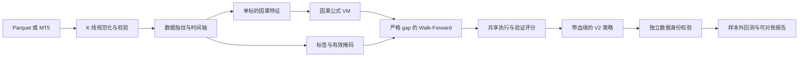

# AlphaMaster Core Correctness V2 设计

- 状态：已确认
- 日期：2026-07-14
- 实施分支：`codex/core-correctness-v2`
- 同步仓库：`Mskila/core-correctness-v2`（private）

## 1. 背景

本轮只修复会影响训练、验证、回测和策略产物可信度的问题。现状中已经确认的核心问题包括：

- VM 输出归一化和 `JUMP` 使用整段序列统计量，历史输出会随未来数据变化。
- walk-forward 在常见长度下会把配置 gap 自动缩为零。
- IC 与实际收益标签额外错开一根 K 线。
- 所有周期共用 H1 的 `6240` 年化常数。
- Parquet 在去重前检查行数，且缺少有限值、OHLC、时间轴等完整校验。
- 多标的数据对齐在交集不足时使用 `union + ffill + bfill`，可能把未来价格回填到过去。
- MT5 缓存可能纳入未闭合 K 线，并冻结同时间戳的旧值。
- 训练、可视化回测和信号模块使用不同的因子到仓位转换逻辑。
- 逐笔交易明细没有完整计入退出成本，无法与总收益对账。
- 熵下限惩罚经 `.item()` 脱离计算图，不能提供预期梯度。
- 检查点缺少周期、数据身份和完整续训状态，可能跨数据错误恢复。
- 当前训练是单标的，但横截面特征和算子仍存在，并退化为常数。

安全、鉴权、CORS、密钥、上传、XSS、前端美化和部署便利性不属于本轮范围。

## 2. 目标与非目标

### 2.1 目标

1. 保证任意时刻的特征和因子只依赖当时及之前的数据。
2. 为标签、训练、IC、验证、回测和交易明细建立唯一的时间索引语义。
3. 保证训练集与验证集之间存在不可退化的时间隔离。
4. 让数据、检查点、策略和回测报告具备可验证的身份与血缘。
5. 让训练、命令行回测、可视化回测和信号模块共享同一执行模型。
6. 让中断续训在固定随机种子下与连续训练等价。
7. 明确区分样本内复盘和独立样本外回测。

### 2.2 非目标

- 不兼容旧检查点、旧策略或旧特征词表；旧产物保留在磁盘但拒绝加载。
- 不在本轮实现真正的多标的横截面训练。
- 不借修复计算错误调整奖励偏好、策略风格或搜索目标。
- 不全面翻新历史研究脚本；官方训练和回测入口不得再依赖这些脚本。
- 不处理任何仅与安全或界面体验有关的问题。

## 3. 方案选择

本轮采用“严格正确性重置”。另外两种方案被拒绝：

- 真正的多标的训练需要重构数据张量、批处理和组合执行，作为后续独立项目处理。
- 只修数学错误的最小补丁仍会保留错误续训、数据混用和产物误标风险。

严格重置允许提升核心语义版本并要求全部重新训练，避免为旧产物提供虚假的兼容保证。

## 4. 核心语义契约

新增统一的核心语义版本，例如 `CORE_SEMANTICS_VERSION = "2"`。以下内容共同构成该版本：

- 特征集合与特征顺序；
- 公式词表与算子实现；
- 因果归一化规则；
- 标签定义与有效标签掩码；
- 因子到仓位转换规则；
- 成本和最终平仓规则；
- walk-forward 切分规则；
- 数据指纹和产物身份字段。

### 4.1 时间语义

对 K 线索引 `t`：

1. 因子在第 `t` 根 K 线收盘后形成。
2. 仓位在 `t+1` 开盘执行。
3. 仓位持有至 `t+2` 开盘。
4. `target_ret[t] = log(open[t+2] / open[t+1])`。
5. 最后两根 K 线没有完整标签，必须通过 `target_valid[t] = false` 排除，不能填零后参与指标。

训练收益、IC、时序 IC、walk-forward 验证、正式回测和交易明细都必须使用该语义。

### 4.2 因果不变量

对于任意截断点 `k`，修改 `k` 之后的原始数据，不得改变任何 `t <= k` 的特征或公式输出。该不变量适用于：

- 所有注册特征；
- VM 出口归一化；
- `JUMP` 及其他时序算子；
- 由多个特征和算子组合得到的公式。

## 5. 总体架构与数据流

新增或收敛为三个共享组件：

- `data_pipeline/validation.py`：K 线规范化、时间轴校验、最小样本检查和数据指纹。
- `model_core/execution.py`：标签有效区间、因子到仓位、成本、最终平仓、指标和交易流水。
- `model_core/artifacts.py`：核心身份、检查点身份、策略身份及兼容性校验。

官方路径的数据流如下：

任何一个校验失败都终止当前操作，不回退到宽松或静默修补路径。

## 6. 数据入口与数据身份

### 6.1 统一规范化

Parquet、MT5 拉取结果和 K 线缓存都通过同一个规范化函数。该函数执行：

1. 要求 `time/open/high/low/close/volume` 字段完整；允许入口层将 `tick_volume` 映射为 `volume`。
2. 将时间转换成统一的 UTC 时间戳表达。
3. 检查 OHLCV 均为有限数；价格必须为正，成交量必须非负。
4. 检查 `high >= max(open, close, low)` 且 `low <= min(open, close, high)`。
5. 检查时间严格递增且时间戳唯一。重复时间戳直接报错，不静默选择其中一条。
6. 根据周期检查相邻 K 线不能短于标称周期；允许周末、休市等更长缺口并在元数据中记录。
7. 所有检查和排序完成后再判断有效样本数。

### 6.2 最小样本

删除面向所有周期的固定 `MIN_BARS = 3000` 放行逻辑。训练所需最小样本由下式派生：

`required_bars = max_feature_lookback + label_lookahead + n_folds * min_fold_bars + (n_folds - 1) * effective_gap`

其中：

- `max_feature_lookback` 从实际启用的特征和算子声明中取得；
- `label_lookahead = 2`；
- `min_fold_bars` 至少覆盖最大归一化窗口，当前默认为 200；
- `effective_gap = max(configured_gap, label_lookahead)`。

若某个 W1 或 MN1 数据集无法形成有效折，系统明确拒绝训练，而不是降低 gap 或制造无意义结果。

### 6.3 数据对齐

当前官方训练保持单标的。保留的多标数据管理代码如果被其他入口调用，只允许真实时间交集；删除 `union + ffill + bfill` 回退。交集不足时返回包含各标的覆盖范围的错误。

### 6.4 MT5 缓存

- 初次和增量拉取都排除位置 0 的未闭合 K 线，或通过周期边界确认其已经闭合。
- 增量更新重新拉取一个尾部修订窗口。
- 相同时间戳以新拉取的闭合数据覆盖旧记录。
- 写入缓存前重新执行统一规范化和身份计算。

### 6.5 数据指纹

规范化后生成稳定指纹，输入包含：

- 标的和周期；
- 首尾时间戳与有效行数；
- 规范化后的 OHLCV 内容；
- 数据模式版本。

指纹用于检查点、策略和回测数据隔离，不用于安全认证。

## 7. 特征、算子与词表

### 7.1 单标的词表

从 V2 特征集和公式词表中删除：

- `REL_RET5`、`REL_RET20`、`REL_VOL`；
- `CS_RANK_RET5`、`CS_ZSCORE_RET20`；
- `CS_RANK`、`CS_SCALE`、`CS_NEUTRALIZE`。

所有基于旧 token id 的 active-feature 配置都必须携带版本；版本不匹配时拒绝加载并要求重新生成。

### 7.2 因果归一化

- VM 出口不再按完整时间轴计算均值和标准差，改为固定窗口的滚动因果归一化。
- 窗口起始不足时只使用已经出现的前缀，并用稳定的最小方差保护。
- `JUMP` 使用同一类滚动因果统计，不读取未来均值或方差。
- 任何清理 `NaN/Inf` 的操作只做数值保护，不能掩盖输入数据校验错误。

### 7.3 配置来源

特征维度只从 V2 词表动态派生。根配置中失真的手写 `INPUT_DIM` 不再作为可执行配置来源。

## 8. Walk-Forward、训练和验证

### 8.1 切分算法

先计算 `effective_gap`，再从总长度中预留全部 gap：

1. `usable = T - (n_folds - 1) * effective_gap`。
2. `block = floor(usable / n_folds)`。
3. 数据按 `block, gap, block, gap, ...` 排列。
4. 每个验证折使用一个未来 block，训练区间为该 block 之前的扩展窗口，当前训练末尾与验证起点之间始终保留完整 gap。

禁止以下退化：

- 自动把 gap 缩为零；
- 训练区间与验证区间重叠；
- 训练集和验证集为同一范围；
- 在样本不足时返回一个伪 walk-forward 折。

### 8.2 指标对齐

- IC 直接比较 `factor[t]` 与 `target_ret[t]`。
- 时序 IC 稳定性使用相同索引和有效标签掩码。
- 训练和验证收益均调用共享执行模块。
- 任何边界外或无效标签不参与均值、方差、IC 或奖励。

### 8.3 奖励和熵

本轮不更改奖励权重和策略偏好。熵下限修复为基于计算图中的张量：

`entropy_floor_loss = lambda * relu(threshold - mean_entropy)`

禁止通过 `.item()` 或重新构造常量张量切断梯度。

## 9. 共享执行与回测

### 9.1 仓位与成本

唯一的仓位转换为：

1. `raw_position[t] = tanh(factor[t])`；
2. 当 `abs(raw_position[t]) < MIN_TRADE_EXPOSURE` 时置零；

因子到仓位的转换本身不依赖收益标签，因此实时信号可以对最新闭合 K 线生成下一期开盘目标仓位。离线训练和回测只在 `target_valid[t]` 为真时评价该仓位的收益。

收益流水使用：

- `turnover[t] = abs(position[t] - position[t-1])`，初始前仓位为零；
- `net_pnl[t] = position[t] * target_ret[t] - turnover[t] * cost_rate`；
- 最后一个有效区间结束后强制把仓位归零，并计入 `abs(last_position) * cost_rate` 的退出成本。

反向换仓的仓位变化自然计入双边成本。训练、命令行回测、可视化和信号模块均调用这一实现。

### 9.2 交易流水

交易流水由共享执行结果派生，不单独重算收益。必须满足：

`sum(trade.net_pnl) == sum(backtest.net_pnl)`

允许浮点容差，但任何超出容差的差异都视为程序错误。

### 9.3 年化

删除官方路径中的 H1 固定常数。根据首个执行时间、最后退出时间和有效收益观测数计算：

- 实际年数；
- 每年有效观测数；
- Sharpe、Sortino、年化收益和 Calmar。

缺少有效时间戳或时间跨度非正时拒绝生成年化指标。

### 9.4 样本内与样本外

- `in_sample_replay`：允许使用训练数据，仅用于诊断，报告必须显式标注。
- `out_of_sample_backtest`：必须显式提供独立数据。测试数据指纹不得等于训练数据指纹，时间范围不得与训练数据重叠，且测试起点必须晚于训练终点。

仅使用训练文件的子集或重写一份相同行情不能绕过检查；除时间范围外，回测入口还比较规范化 bar 身份，发现任何训练行情重叠都拒绝标记为样本外。

标的、周期、核心版本、词表或执行语义不匹配时直接报错。禁止自动把策略标的替换为数据文件中的其他标的。

## 10. 检查点与策略产物

### 10.1 身份

检查点身份至少包含：

- 核心语义版本和词表版本；
- 标的、周期和数据指纹；
- 标签定义和执行语义版本；
- 影响训练行为的配置摘要及其稳定哈希。

建议文件名：

- `ckpt_v2_{symbol}_{timeframe}_{data_hash12}_step_{step}.pt`
- `best_v2_{symbol}_{timeframe}_{data_hash12}.json`

文件名只方便定位，加载时仍必须检查内部完整身份。

### 10.2 完整续训状态

检查点保存：

- 模型与优化器状态；
- 当前步数及学习率相关状态；
- 奖励 EMA 及其 warmup 步数；
- 精英池和对应年龄/衰减状态；
- 最佳结果、最佳更新时间和停滞计数；
- 重启次数、低熵连续计数及自适应噪声状态；
- Python、NumPy、PyTorch CPU/CUDA 随机数状态。

只有全部身份一致时允许续训。`from_scratch` 不读取检查点，也不从旧策略播种。

### 10.3 策略血缘

V2 策略记录：

- 公式 token 和可读公式；
- 核心、词表、标签及执行版本；
- 训练数据身份；
- 每个 walk-forward 折的时间范围和验证结果；
- 训练配置摘要；
- 生成时间和产物指纹。

样本外结果存放在回测报告中，不反写为训练选择依据。

## 11. 错误处理

核心入口采用 fail-closed 行为，并给出可操作错误：

- `DataValidationError`：列、数值、OHLC、时间轴或样本量错误；
- `DatasetAlignmentError`：真实交集不足；
- `ArtifactCompatibilityError`：版本、标的、周期、配置或数据身份不匹配；
- `InsufficientWalkForwardDataError`：无法构建具有完整 gap 的折；
- `BacktestModeError`：相同训练数据被用于样本外回测。

错误信息同时显示 expected 和 actual，不自动回退到旧逻辑。

## 12. 测试与验收

每项缺陷遵循测试先行：先添加能够稳定失败的测试，再修改实现。

### 12.1 单元与性质测试

- 修改未来行情不能改变历史特征或因子。
- 所有 walk-forward 折保留完整 gap，标签不跨边界。
- IC、训练收益和回测收益使用同一标签索引。
- 重复时间戳、非法 OHLC、非有限数、未来回填被拒绝。
- MT5 未闭合 K 线不进入缓存，同时间戳修订值覆盖旧值。
- 单标 V2 词表不包含横截面特征或算子。
- 熵低于阈值时惩罚对 logits 产生非零梯度。
- 不同标的、周期、数据、配置或版本的检查点无法续训。
- 固定种子下连续训练与保存后续训状态一致。
- 所有官方入口对同一因子产生相同仓位。
- 交易流水与回测净收益严格对账。
- 相同训练数据不能运行样本外回测。
- 年化指标与实际时间戳跨度一致。

### 12.2 测试基础设施

增加根级 pytest 配置，只收集正式测试目录，防止诊断脚本在收集阶段访问本地 HTTP 服务。现有过时测试按 V2 明确语义更新；与核心能力无关的安全测试不作为本轮交付内容。

### 12.3 端到端验收

1. 使用小型确定性数据完成短训练。
2. 在中途保存并续训，与相同步数的连续训练比较状态。
3. 生成 V2 策略并执行样本内复盘。
4. 验证同数据样本外回测被拒绝。
5. 使用独立数据完成样本外回测并核对交易流水。
6. 运行正式测试全集并记录通过数、失败数和耗时。

## 13. 迁移与发布

- 旧检查点和旧策略不删除、不改名、不覆盖，只在加载时判定不兼容。
- V2 产物采用独立命名，避免与旧产物冲突。
- 所有代码先在 `codex/core-correctness-v2` worktree 中完成。
- 当前 `main` 已作为基线同步到私有仓库 `Mskila/core-correctness-v2`。
- 后续经过测试的提交推送到私有仓库同名开发分支；是否合入其 `main` 在最终验收后决定。

## 14. 明确搁置项

以下内容即使在审计中存在问题，本轮也不修改：

- 鉴权、CORS、密钥与凭据管理；
- 文件上传、路径穿越、反序列化和远程代码执行防护；
- XSS、错误堆栈暴露和 Feishu URL 安全；
- 前端视觉、交互美化和一般部署便利性；
- 与官方训练/回测入口无关的历史分析脚本重构。
